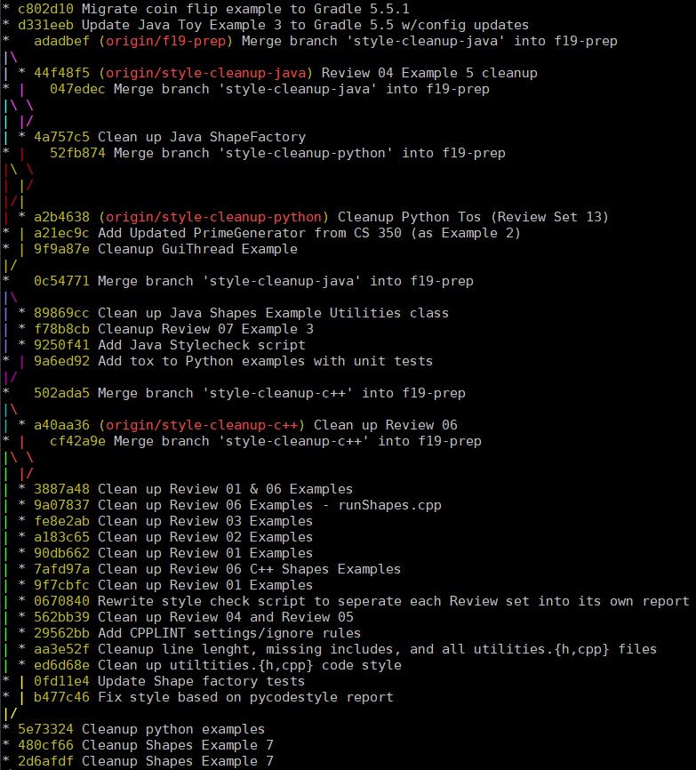
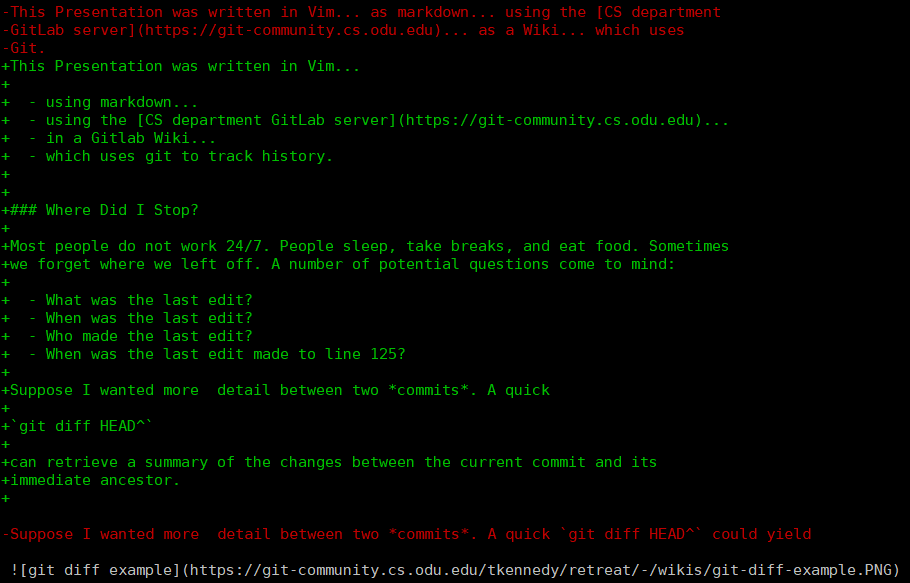
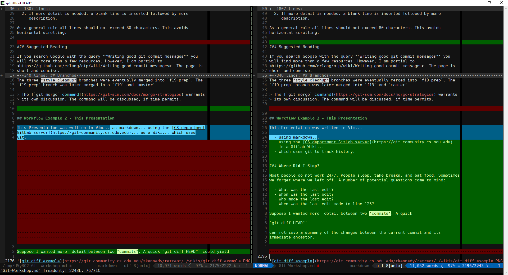

> I am going to go for a Raymond Hettinger style presentation,
> <https://www.cs.odu.edu/~tkennedy/cs330/s20/Public/languageResources/#python-programming-videos>.
>
> These materials are web-centric (i.e., do not need to be printed and are
> available at <https://www.cs.odu.edu/~tkennedy/git-workshop>).


# Who am I?

I have taught various courses, including:

  - CS 300T - Computers in Society
  - CS 333 - Programming and Problem Solving
  - CS 330 - Object Oriented Programming and Design
  - CS 350 - Introduction to Software Engineering
  - CS 410 - Professional Workforce Development I
  - CS 411W - Professional Workforce Development II
  - CS 417 - Computational Methods & Software

Most of my free time is spent writing Python 3 *and Rust* code, tweaking my Vim
configuration, or learning a new (programming) language. My current language of
interest is Rust (at the time of writing).


# Referenced Courses & Materials

I am going to pull from CS 330, CS 350, CS 411W, and CS 417 lecture notes

  - **CS 330 - Object Oriented Programming & Design**
    - [S.O.L.I.D](https://www.cs.odu.edu/~tkennedy/cs330/s20/Public/reviewSOLID/)
    - [Iterators](https://www.cs.odu.edu/~tkennedy/cs330/s20/Public/designDiscussionIterators/)
  - **CS 350 - Introduction to Software Engineering**
  - **CS 411W - Professional Workforce Development II**
    - [Git Review](https://www.cs.odu.edu/~tkennedy/cs411/s20/Public/gitIntro/)
  - **CS 417 - Computational Methods & Software**
    - [Python non-linear solver discussion](https://www.cs.odu.edu/~tkennedy/cs417/s20/Public/solverDiscussion/)


# The Broad Strokes

The focus of this presentation is *The Basics of Git*. However, I will
reference a few other concepts...

## Best Practices

   - Design Paradigms
     - *S.O.L.I.D*
     - Iterators - *(CS 330)*
   - Modern Language Constructs

## Tools of the Trade

   - **Vim (the only editor anyone ever needs)**
   - Configuration Management
     - External Libraries
     - Cross-compilation
   - Continuous Integration & Deployment
     - [Jenkins](https://jenkins.io/)
     - [Gitlab CI](https://about.gitlab.com/product/continuous-integration/)
     - [Travis CI](https://travis-ci.org/)
     - [Azure Pipelines](https://azure.microsoft.com/en-us/services/devops/pipelines/)
     - [AWS CodePipeline](https://aws.amazon.com/codepipeline/)
   - Documentation
     - Javadoc
     - Pydoc
     - Doxygen
     - Rustdoc
   - Code Style
     - Static Code Analysis
     - Code Linters
     - Style Checkers


## Testing & Development

   - Test Driven Development
   - [Unit Testing & Integration Testing](https://doc.rust-lang.org/book/ch11-03-test-organization.html)
   - [Hamcrest Matchers](http://hamcrest.org/)


---


# Git

Git is a *Version Control Platform* that allows an individual or a team to track
changes to a codebase. This includes maintaining records of what changes were,
when changes were made, and by whom changes were made. This not only facilitates
tracking progress.

**Git is Not...**

  - [GitHub](https://github.com/)
  - [GitLab](https://about.gitlab.com/)
  - [BitBucket](https://bitbucket.org/product)
  - [Gitea](https://gitea.io/en-us/)

**Git can be used...**

  - Locally
  - With SSH URL trickery
  - With multiple remotes (e.g., GitHub and <https://git-community.cs.odu.edu> at the
    same time)
  - By one person
  - By multiple people

**Git allows one to...**

  1. Explore alternative approaches.
  2. Reconcile conflicting changes (through `merge` and `rebase`).
  3. Compare differences between *branches* and *commits*.


# The Punchline - Tracking History

At the most basic level Git tracks changes to source *text* (usually code).

**No more...**

  - Who has the newest version of code?
  - Didn't Tom "fix" the memory leaks in the `NaivePool` allocator class?
  - When was line 122 in `NaivePool` last modified?
  - By whom was line 122 in `NaivePool` last modified?

**Variants of...**

  - `git log`
  - `git blame`
  - `git stats`

can be used to answer these types of questions.


## Workflow Example 1 - CS 330 Lecture Examples

Most of my CS 330 lectures are based on a set of Review Examples. A brief
history can be obtained with

```sh
git -C ~/Courses/Reviews/cs330/s20 log --since 'January 1 2019' --graph --decorate --all
```


<details>

<summary>*Updates since 11 January 2019*</summary>

```

* commit eefa03bf1070123ee73b8d969895eaab791f979d (HEAD, origin/s20, origin/master, origin/HEAD, s20, master)
| Author: Thomas J. Kennedy <tkennedy@cs.odu.edu>
| Date:   Wed Feb 19 08:58:26 2020 -0500
|
|     Add profiling compilation flags to Review 03 Example 6
|
* commit 2dbf7c650c53b749773aafb22aefc3f7fa4aa17f
| Author: Thomas J. Kennedy <tkennedy@cs.odu.edu>
| Date:   Tue Feb 11 17:22:44 2020 -0500
|
|     Update Python pydoc style
|
* commit 0c13d43ebfec48fdf5a3aef84e3feee1ab72eee1
| Author: Thomas J. Kennedy <tkennedy@cs.odu.edu>
| Date:   Sat Feb 8 09:40:13 2020 -0500
|
|     Update docstrings to follow Google Style
|
* commit 7f6392c241fda99d68b09f84e05780c01396088f
| Author: Thomas J. Kennedy <tkennedy@cs.odu.edu>
| Date:   Tue Feb 4 17:33:29 2020 -0500
|
|     Correct '{' style issues
|
* commit 84e791ca0ec9c339c32143ccbb08854a624ee27e
| Author: Thomas J. Kennedy <tkennedy@cs.odu.edu>
| Date:   Mon Feb 3 19:46:56 2020 -0500
|
|     Add style corrections from Review 03 lectures
|
* commit 0da91a6bc0c3d6a51ad5bfca2d8b89a58f468bc1
| Author: Thomas J. Kennedy <tkennedy@cs.odu.edu>
| Date:   Thu Jan 30 17:26:03 2020 -0500
|
|     Update md file with current s20 updates
|
* commit 98399d3083ea491de3a8ee58361cda1f1e6d33c2
| Author: Thomas J. Kennedy <tkennedy@cs.odu.edu>
| Date:   Thu Jan 30 17:05:39 2020 -0500
|
|     Add gcovr demo to final Review 03 C++ Example
|
* commit 0bff9c51285946f8306c5c2827ded44b1ddf4c01
| Author: Thomas J. Kennedy <tkennedy@cs.odu.edu>
| Date:   Thu Jan 30 17:03:10 2020 -0500
|
|     Fix REview 02 whitespace/style
|
* commit c93963474cf73315500e00fd3e7aa43ab7e5c240
| Author: Thomas J. Kennedy <tkennedy@cs.odu.edu>
| Date:   Tue Jan 28 14:48:26 2020 -0500
|
|     Add Tox to Review 03 Python example
|
* commit 641abc3a9ba478a9da590be4fe5446e92a0604eb
| Author: Thomas J. Kennedy <tkennedy@cs.odu.edu>
| Date:   Tue Jan 28 14:38:34 2020 -0500
|
|     Tweak Review 03 Python example
|
* commit 8314e156d51673d9d361d42e14d1a87c2edf9ebc
| Author: Thomas J. Kennedy <tkennedy@cs.odu.edu>
| Date:   Tue Jan 28 12:53:17 2020 -0500
|
|     Correct typos
|
* commit 2788930df4612e8afc484deb3695006b2e471ec1
| Author: Thomas J. Kennedy <tkennedy@cs.odu.edu>
| Date:   Tue Jan 28 12:43:14 2020 -0500
|
|     Make final? round of tweaks to Review 03 Python example
|
* commit 3cea3f34dd7df67d299527ac73f14ae6dbf4d92b
| Author: Thomas J. Kennedy <tkennedy@cs.odu.edu>
| Date:   Tue Jan 28 12:27:54 2020 -0500
|
|     Make second pass through Python Review-03 example
|
* commit 4ee14c71b6cafc0aff4d3026c512fb48e6690713
| Author: Thomas J. Kennedy <tkennedy@cs.odu.edu>
| Date:   Mon Jan 27 22:21:14 2020 -0500
|
|     Create first working draft of Python Review-03 example
|
* commit 7547ea9df729a77402518e0c8efd188937e80f64
| Author: Thomas J. Kennedy <tkennedy@cs.odu.edu>
| Date:   Sat Jan 25 15:53:52 2020 -0500
|
|     Tweak Rust House example
|
* commit 43bab1ead7eee6515d5dc84a793368556e6c34ce
| Author: Thomas J. Kennedy <tkennedy@cs.odu.edu>
| Date:   Sat Jan 25 12:43:47 2020 -0500
|
|     Update Example 7 and promote it to Example 6
|
* commit 4ecbd2f662e20267662687f9056879fb2f0c6dfd
| Author: Thomas J. Kennedy <tkennedy@cs.odu.edu>
| Date:   Sat Jan 25 12:39:09 2020 -0500
|
|     Update Example 6 and promote it to Example 5
|
* commit 7291f3a5e67db74693e6e956fe8141c0191debf3
| Author: Thomas J. Kennedy <tkennedy@cs.odu.edu>
| Date:   Sat Jan 25 12:30:56 2020 -0500
|
|     Update Example 5 and promote it to Example 4
|
* commit 9b56a10150a5968e827a9cf19d3633add126961c
| Author: Thomas J. Kennedy <tkennedy@cs.odu.edu>
| Date:   Sat Jan 25 12:23:37 2020 -0500
|
|     Update Example 4 to serve as (and replace) Example 3
|
* commit 15374dc6c1218bfa58b0e8e32b1bd014e7795ae3
| Author: Thomas J. Kennedy <tkennedy@cs.odu.edu>
| Date:   Sat Jan 25 12:16:35 2020 -0500
|
|     Update Review-03/Example{1,2}
|
|       1. Use swap method to implement assignment operator
|       2. Use Constructor Delegation for House class
|
* commit 23be84d0d559a3a53904d7243882df8850bb511d
| Author: Thomas J. Kennedy <tkennedy@cs.odu.edu>
| Date:   Sat Jan 25 08:48:49 2020 -0500
|
|     Merge Review 03 Example-2 and Example 3 discussions
|
|     The copy-and-swap idiom was added to Review 01.
|
* commit 54288621af5bf2ec56de52c7f6a591b23565fd21
| Author: Thomas J. Kennedy <tkennedy@cs.odu.edu>
| Date:   Thu Jan 23 17:31:55 2020 -0500
|
|     Renumber Review 03 Examples
|
* commit dc20c56afd2c2e3dcd2a0809ea64c1e1dfa3f4ae
| Author: Thomas J. Kennedy <tkennedy@cs.odu.edu>
| Date:   Thu Jan 23 17:28:32 2020 -0500
|
|     Remove copy-and-pasted examples
|
|     Review-03 Examples 1 and 3 were copied and pasted from Example 2 for
|     reference. They were removed in preperation for cleanup and renumbering.
|
* commit 2b6ccd118efff2fdbe6fc3083ca921c6cda67bfd
| Author: Thomas J. Kennedy <tkennedy@cs.odu.edu>
| Date:   Fri Jan 10 14:26:36 2020 -0500
|
|     Clean up Review 01 Example style
|
* commit 3c989b14cdfb64bbc7705c9cfa286e1a01a95baa (origin/f19)
| Author: Thomas J. Kennedy <tkennedy@cs.odu.edu>
| Date:   Sat Dec 7 13:01:09 2019 -0500
|
|     Record tox and Python Shape (live) discussion updates
|
* commit 0cba1b9bd6195d6570f384434501c5f7f5505bb6
| Author: Thomas J. Kennedy <tkennedy@cs.odu.edu>
| Date:   Tue Dec 3 14:22:34 2019 -0500
|
|     Record style tweaks from lecture
|
* commit 39ae53eae812e605a17be95220d71771a66442d1
| Author: Thomas J. Kennedy <tkennedy@cs.odu.edu>
| Date:   Tue Dec 3 08:44:59 2019 -0500
|
|     Add javadoc typo corrections from live discussion
|
* commit e69105b44ae1f112b125e27f774df29129bd8339
| Author: Thomas J. Kennedy <tkennedy@cs.odu.edu>
| Date:   Thu Nov 21 15:52:43 2019 -0500
|
|     Write a quick intstream example
|
* commit fae0ecb5646467c4ddc426926e9e807665783385
| Author: Thomas J. Kennedy <tkennedy@cs.odu.edu>
| Date:   Thu Nov 21 12:41:10 2019 -0500
|
|     Correct a couple minor documentation typos
|
* commit b296cddd959fa971ed190b9de22443324741ad69
| Author: Thomas J. Kennedy <tkennedy@cs.odu.edu>
| Date:   Tue Nov 19 20:12:44 2019 -0500
|
|     Update jacoco tool version from 0.8.0 to 0.8.5
|
* commit a398f20e092530a85468bee4a5a218a191086a59
| Author: Thomas J. Kennedy <tkennedy@cs.odu.edu>
| Date:   Sat Nov 16 13:40:53 2019 -0500
|
|     Remove makefiles from Java Shapes Examples
|
* commit 93edd26cca57b4242c756e8cfaeff3035845b613
| Author: Thomas J. Kennedy <tkennedy@cs.odu.edu>
| Date:   Sat Nov 16 13:40:19 2019 -0500
|
|     Tweak Java Shapes Example (RunShapes)
|
* commit ac9ef216c5510786f1d08f2f58459fa69ccde042
| Author: Thomas J. Kennedy <tkennedy@cs.odu.edu>
| Date:   Sat Nov 16 13:20:54 2019 -0500
|
|     Tweak Python Shapes Example
|
* commit f6c154f36fb677dd861ddc3f2040bd778bdfed9f
| Author: Thomas J. Kennedy <tkennedy@cs.odu.edu>
| Date:   Fri Nov 15 22:48:41 2019 -0500
|
|     Tweak Python Shapes Examples
|
* commit 20f2607e3f394e2d0552e672b047c70b7611f96f
| Author: Thomas J. Kennedy <tkennedy@cs.odu.edu>
| Date:   Fri Nov 15 09:56:04 2019 -0500
|
|     Update last Java Shapes example
|
|       1. Cleanup RunShapes.java imports, comments, and line breaks
|       2. Tweak Utilities.java Javadoc comments and change / ops to << ops
|       3. Change Checkstyle regex for Class member name convention
|
* commit f7cbd3b729afab8455d9105b9bf3cb5cf3ab03a2
| Author: Thomas J. Kennedy <tkennedy@cs.odu.edu>
| Date:   Thu Nov 14 21:49:44 2019 -0500
|
|     Tweak ShapeIterator logic
|
|     ShapeIterator will continue reading from the buffer if null is
|     encountered (null values are skipped). The ShapeIterator only stops when
|     the end of the buffer is reached (i.e., theBuffer.readline() == null).
|
* commit cbcb9dbeffebd3a6241eaa29fb13e845ebba055e
| Author: Thomas J. Kennedy <tkennedy@cs.odu.edu>
| Date:   Thu Nov 14 20:59:06 2019 -0500
|
|     Add documentation to ShapeIterator
|
* commit 2a4dc013579060c6e08c03b04c0da76db520250a
| Author: Thomas J. Kennedy <tkennedy@cs.odu.edu>
| Date:   Thu Nov 14 16:44:43 2019 -0500
|
|     Finlalize? ShapeIterator for final Java Shapes example
|
|     Shout out to Jeffrey
|
* commit f19ec32c632f2d79aef09ad3cabaa26a1fd8d901
| Author: Thomas J. Kennedy <tkennedy@cs.odu.edu>
| Date:   Thu Nov 14 09:50:14 2019 -0500
|
|     Start custom Java Iterator implementation example
|
*   commit 09700e9701c742b55333082cdbab003001ee7638
|\  Merge: dfe3461 7621d29
| | Author: Thomas J. Kennedy <tkennedy@cs.odu.edu>
| | Date:   Wed Nov 13 09:06:36 2019 -0500
| |
| |     Merge branch 'f19' of git-community.cs.odu.edu:tkennedy/cs330-examples into f19
| |
| * commit 7621d29c28effaec3a0851c63bfe441df775d50f
| | Author: Thomas J. Kennedy <tkennedy@cs.odu.edu>
| | Date:   Tue Nov 12 22:34:57 2019 -0500
| |
| |     Tweak Python Linked List example
| |
* | commit dfe34619bd5b21e220af804caa56ebac13309642
|/  Author: Thomas J. Kennedy <tkennedy@cs.odu.edu>
|   Date:   Wed Nov 13 09:03:25 2019 -0500
|
|       Replace ActionListener with lambda in Prime Gui Example
|
* commit 5a6e0798e57161363b694e0011ec24209f63c761
| Author: Thomas J. Kennedy <tkennedy@cs.odu.edu>
| Date:   Mon Nov 11 21:10:08 2019 -0500
|
|     Make another round of tweaks to Python Linked List
|
|     This should be the last round of changes. The discussion of Python best
|     practices (along with those for C++14+ and Java) are now introduced in
|     earlier examples.
|
* commit 564d1f21a721822522a0110ef3df3aae1ac128e9
| Author: Thomas J. Kennedy <tkennedy@cs.odu.edu>
| Date:   Mon Nov 11 20:55:03 2019 -0500
|
|     Rename Python Linkked List files to follow convention
|
* commit cc8f237d615fda74c588a9cbc268e14f099f6a84
| Author: Thomas J. Kennedy <tkennedy@cs.odu.edu>
| Date:   Mon Nov 11 20:31:50 2019 -0500
|
|     Start tweaks to Python Linked List Example
|
* commit a59416b24a82f98bb81751d4a029273ce5f287d3
| Author: Thomas J. Kennedy <tkennedy@cs.odu.edu>
| Date:   Mon Nov 11 14:18:17 2019 -0500
|
|     Tweak Python Linked List Example
|
* commit 3fb174bfadf3ed9ca4b71af7ffb7927809d425e0
| Author: Thomas J. Kennedy <tkennedy@cs.odu.edu>
| Date:   Mon Nov 11 13:04:48 2019 -0500
|
|     Tweak Python Toy Examples
|
* commit cd3b55cf536253e3cf7477ac29e98dfd8830a25a
| Author: Thomas J. Kennedy <tkennedy@cs.odu.edu>
| Date:   Mon Nov 11 13:00:21 2019 -0500
|
|     Tweak Python Shapes Example
|
* commit 832be20fd09f9d29599be6c78c54fcae090f9536
| Author: Thomas J. Kennedy <tkennedy@cs.odu.edu>
| Date:   Mon Nov 11 09:11:39 2019 -0500
|
|     Move deploy-all.py to its own Git repo
|
|     deploy-all.py has grown beyond its initial temporary bodge
|     implementation. It now justifies its own repo.
|
* commit aa53220eeb3609bf827528adb8a69418c906abe8
| Author: Thomas J. Kennedy <tkennedy@cs.odu.edu>
| Date:   Sun Nov 10 15:43:51 2019 -0500
|
|     Tweak Final JAva Shapes Example
|
|       1. Tweak RunShapes.main
|       2. Add Shape.read unit tests
|
* commit 7e3003251af9282e5eb6b0b9341ec83efcf08fbe
| Author: Thomas J. Kennedy <tkennedy@cs.odu.edu>
| Date:   Sun Nov 10 15:20:49 2019 -0500
|
|     Fix deploy --all-dirs zipfile logic
|
* commit 71c446fd1485ee53e6ab783a25c671ca6c4f80e6
| Author: Thomas J. Kennedy <tkennedy@cs.odu.edu>
| Date:   Sat Nov 9 15:08:19 2019 -0500
|
|     Copy Java Shapes Unit Tests into Examples 2 to 6
|
* commit 73813f8d6854963ed49504d9bc04d8aff7c8617f
| Author: Thomas J. Kennedy <tkennedy@cs.odu.edu>
| Date:   Sat Nov 9 14:58:09 2019 -0500
|
|     Finalize Java Shape Unit Tests
|
* commit 773c87cfb091c6a933285501930aaa51cb97de75
| Author: Thomas J. Kennedy <tkennedy@cs.odu.edu>
| Date:   Sat Nov 9 13:06:41 2019 -0500
|
|     Moved TestShapeFactory to Example 2
|
* commit d5524dfc8167499d8c8a6b63d5065ed316d64b0e
| Author: Thomas J. Kennedy <tkennedy@cs.odu.edu>
| Date:   Sat Nov 9 12:01:31 2019 -0500
|
|     Tweak Java Shapes Example drivers
|
* commit 05f158c838b568539e49033c03d535f95139393d
| Author: Thomas J. Kennedy <tkennedy@cs.odu.edu>
| Date:   Sat Nov 9 12:01:04 2019 -0500
|
|     Start porting Python Shape unit tests to Java
|
* commit d63532e44cb0f6462c3ab394c724542226a4d333
| Author: Thomas J. Kennedy <tkennedy@cs.odu.edu>
| Date:   Fri Nov 8 21:20:24 2019 -0500
|
|     Start updates to Java Shapes Examples
|
* commit 3d586a731a5b84b63ed4b1ec96d6558b2d6c28b6
| Author: Thomas J. Kennedy <tkennedy@cs.odu.edu>
| Date:   Wed Nov 6 14:51:42 2019 -0500
|
|     Finalize Review 06 Example 9
|
* commit c691bd3e6719fdd9bc93b07861130654a69f5495
| Author: Thomas J. Kennedy <tkennedy@cs.odu.edu>
| Date:   Wed Nov 6 14:41:05 2019 -0500
|
|     Tweak deploy script output
|
* commit 2b1b2f606b3099eb27e5bd675774197824e93c26
| Author: Thomas J. Kennedy <tkennedy@cs.odu.edu>
| Date:   Tue Nov 5 17:14:55 2019 -0500
|
|     Add templated transform_if example
|
* commit 598b0649296dfd415fa79f00bf267b3983965138
| Author: Thomas J. Kennedy <tkennedy@cs.odu.edu>
| Date:   Tue Nov 5 17:14:32 2019 -0500
|
|     Apply updates from lecture
|
* commit 716dbafa24948ae727fc47218953f296ad66de07
| Author: Thomas J. Kennedy <tkennedy@cs.odu.edu>
| Date:   Sat Nov 2 13:38:39 2019 -0400
|
|     Update Review readme
|
* commit 751674915903812544a4c6f776e5b328dae515de
| Author: Thomas J. Kennedy <tkennedy@cs.odu.edu>
| Date:   Thu Oct 31 15:36:11 2019 -0400
|
|     Add commented alternative to auto in lambda
|
* commit 2417cfcc1b9f4de907342348f60815d744fa28d2
| Author: Thomas J. Kennedy <tkennedy@cs.odu.edu>
| Date:   Tue Oct 29 17:37:53 2019 -0400
|
|     Update Python Shapes Example to use @abstractmethod
|
* commit 3f1fa054236aef5763f55886e6d2b1a483d8cd7a
| Author: Thomas J. Kennedy <tkennedy@cs.odu.edu>
| Date:   Tue Oct 29 15:36:42 2019 -0400
|
|     Tweak whitespace in C++ Fibonacci example
|
* commit dc96b0109ef1dd1407662b922d9bd679ae09bc4c
| Author: Thomas J. Kennedy <tkennedy@cs.odu.edu>
| Date:   Tue Oct 29 15:30:52 2019 -0400
|
|     Tweak Shapes C++ Example 9
|
* commit 277b96a0a32c42a2a7cdcd63cd30f4338638abf2
| Author: Thomas J. Kennedy <tkennedy@cs.odu.edu>
| Date:   Wed Oct 23 09:09:41 2019 -0400
|
|     Finalize C++ Shapes new Example 9
|
* commit 2b335ecfc20cd77625fa7d554c36ff3c1024cb8c
| Author: Thomas J. Kennedy <tkennedy@cs.odu.edu>
| Date:   Mon Oct 21 18:17:40 2019 -0400
|
|     Fix silly typos
|
* commit fb13109d8fe2d5f8359dac6a27f6a2e68dd420a5
| Author: Thomas J. Kennedy <tkennedy@cs.odu.edu>
| Date:   Mon Oct 21 18:13:38 2019 -0400
|
|     Add explict '= default' for Big-3
|
* commit 1b2c0a7ea5c529babe4ed3062d478e6b7ea26f76
| Author: Thomas J. Kennedy <tkennedy@cs.odu.edu>
| Date:   Mon Oct 21 18:05:12 2019 -0400
|
|     Refactor print utility functions
|
* commit 2d8602c3af01119772bfa2ac334d8d4979a75260
| Author: Thomas J. Kennedy <tkennedy@cs.odu.edu>
| Date:   Wed Oct 9 16:09:09 2019 -0400
|
|     Tweak Review 05
|
* commit ea4d9841f3f5b04d5b0d5fd72e6f6095555b6d7b
| Author: Thomas J. Kennedy <tkennedy@cs.odu.edu>
| Date:   Wed Oct 9 15:15:38 2019 -0400
|
|     Add some constructor delegation
|
* commit 224ddca1317550170b84c120586399ddc1e75e49
| Author: Thomas J. Kennedy <tkennedy@cs.odu.edu>
| Date:   Wed Oct 9 13:14:19 2019 -0400
|
|     Add more lambda demos
|
* commit 082da8f6d34c8305e939166b7e0e4ab1896703f7
| Author: Thomas J. Kennedy <tkennedy@cs.odu.edu>
| Date:   Wed Oct 9 10:19:47 2019 -0400
|
|     Refactor output utilities using template trickery
|
* commit 3866422c7ad87fa7f43846ac9358f401ac9378e9
| Author: Thomas J. Kennedy <tkennedy@cs.odu.edu>
| Date:   Tue Oct 8 22:01:49 2019 -0400
|
|     More string view/utility updates
|
*   commit 181c0284c2f42776445451a4ec7c167336cc928b
|\  Merge: 2292b1a 59efca7
| | Author: Thomas J. Kennedy <tkennedy@cs.odu.edu>
| | Date:   Tue Oct 8 22:00:29 2019 -0400
| |
| |     Merge branch 'f19' of git-community.cs.odu.edu:tkennedy/cs330-examples into f19
| |
| * commit 59efca75a4a2d29ca5dae844dc01893aaebe0288
| | Author: Thomas J. Kennedy <tkennedy@cs.odu.edu>
| | Date:   Tue Oct 8 09:10:43 2019 -0400
| |
| |     Update C++ shapes discussion makefiles
| |
* | commit 2292b1a291a962955a08b0939997ee0b4d46299e
|/  Author: Thomas J. Kennedy <tkennedy@cs.odu.edu>
|   Date:   Tue Oct 8 09:10:43 2019 -0400
|
|       More string view/utility updates
|
* commit 8325ed0743bc4416159ce48c8c743c728e09930b
| Author: Thomas J. Kennedy <tkennedy@cs.odu.edu>
| Date:   Mon Oct 7 21:14:15 2019 -0400
|
|     Update utilities library to use string_view
|
* commit 82ff00106160310329ba4b882ed576b6785b9652
| Author: Thomas J. Kennedy <tkennedy@cs.odu.edu>
| Date:   Mon Oct 7 17:21:56 2019 -0400
|
|     Start Example 9 (demo C++20 features - string_view)
|
* commit e1fc4a5842f3e0aef14325c251892c8b19c94ab5
| Author: Thomas J. Kennedy <tkennedy@cs.odu.edu>
| Date:   Mon Sep 23 18:23:24 2019 -0400
|
|     Fix C++ Doxygen to Rustdoc comment oversight
|
* commit 197e7bb575aea99511ea4801f0a90a7da03e17f6
| Author: Thomas J. Kennedy <tkennedy@cs.odu.edu>
| Date:   Thu Sep 19 20:21:18 2019 -0400
|
|     Tweak Final C++ Room Renovation Example
|
*   commit de989b5736eba7a86e7abf65821c860ac88455e0
|\  Merge: 2198332 8652410
| | Author: Thomas J. Kennedy <tkennedy@cs.odu.edu>
| | Date:   Thu Sep 19 10:41:40 2019 -0400
| |
| |     Merge branch 'f19' of git-community.cs.odu.edu:tkennedy/cs330-examples into f19
| |
| * commit 865241038ddb517c5d0ad7f5bd649476f8df8997
| | Author: Thomas J. Kennedy <tkennedy@cs.odu.edu>
| | Date:   Wed Sep 18 22:20:41 2019 -0400
| |
| |     Add std::bind to Example 9
| |
* | commit 21983323a4c0bd70654b32470e0d8805fe5fbdfe
|/  Author: Thomas J. Kennedy <tkennedy@cs.odu.edu>
|   Date:   Thu Sep 19 10:41:32 2019 -0400
|
|       Correct spacing in House.h
|
* commit 226e9f7175f59ea8c870b90abd85b3fa15136661
| Author: Thomas J. Kennedy <tkennedy@cs.odu.edu>
| Date:   Mon Sep 16 19:06:31 2019 -0400
|
|     Update Plant UML Seq Diagram with underlines and aliases
|
*   commit c0ba4cda0a26f62635fe93727f6db32a9eeb904c
|\  Merge: ebc296e a114b8b
| | Author: Thomas J. Kennedy <tkennedy@cs.odu.edu>
| | Date:   Fri Sep 13 22:15:25 2019 -0400
| |
| |     Merge branch 'f19' of git-community.cs.odu.edu:tkennedy/cs330-examples into f19
| |
| * commit a114b8b100c0281b561a5c0793a52e12acc32fc1
| | Author: Thomas J. Kennedy <tkennedy@cs.odu.edu>
| | Date:   Wed Sep 11 23:07:59 2019 -0400
| |
| |     Add missing typehints to Review 04 Example 7
| |
* | commit ebc296e673ab8df269a1dc5d387c6c69e5518e79
|/  Author: Thomas J. Kennedy <tkennedy@cs.odu.edu>
|   Date:   Fri Sep 13 22:15:15 2019 -0400
|
|       Add Plant UML Seq Diagram example
|
* commit 04b4462818ffe0aad95261ad9642b6a743b1ee73
| Author: Thomas J. Kennedy <tkennedy@cs.odu.edu>
| Date:   Tue Sep 10 21:03:13 2019 -0400
|
|     Refactor TicTacToe Python Example 7
|
* commit d83fb145f0ca63387af99e22478a3b7826ca496a
| Author: Thomas J. Kennedy <tkennedy@cs.odu.edu>
| Date:   Tue Sep 10 09:29:26 2019 -0400
|
|     Review 04 Doc Comment Cleanup based on Google/Sphinx format
|
* commit 860214a095605e8696d3d61ceb0bf6d51907fc8b
| Author: Thomas J. Kennedy <tkennedy@cs.odu.edu>
| Date:   Tue Sep 10 08:53:41 2019 -0400
|
|     Review 04 Style cleanup based on pylint and pycodestyle
|
* commit bb283babdd5bc44a7e4dbfa80f3aa75175c4eeed
| Author: Thomas J. Kennedy <tkennedy@cs.odu.edu>
| Date:   Mon Sep 9 21:13:34 2019 -0400
|
|     First pass at Review 04 Example 7 -> Pylint cleanup example
|
* commit d0563685a6b5b613b213156bddd6ad34ca29130d
| Author: Thomas J. Kennedy <tkennedy@cs.odu.edu>
| Date:   Mon Sep 9 20:36:28 2019 -0400
|
|     Remove 'src' sub dir from Python TicTactoe example
|
* commit 8541260bf8939606271ba2850a04f83721b9d3a4
| Author: Thomas J. Kennedy <tkennedy@cs.odu.edu>
| Date:   Mon Sep 9 20:23:22 2019 -0400
|
|     allow Err to be ignored for writeln! macros
|
* commit f43f7758e9293e23cd044063987eb8a64c8264f4
| Author: Thomas J. Kennedy <tkennedy@cs.odu.edu>
| Date:   Mon Sep 9 17:44:03 2019 -0400
|
|     Finalize Rust Room Renovation Example (documentation Default Trait)
|
* commit 04fb0df78aecd40fa37335d723f2a037aed60a82
| Author: Thomas J. Kennedy <tkennedy@cs.odu.edu>
| Date:   Sun Sep 8 15:22:45 2019 -0400
|
|     Add Rust support to deploy script
|
* commit e183c91193c3296f4870ec5ffb4c8d04a679b719
| Author: Thomas J. Kennedy <tkennedy@cs.odu.edu>
| Date:   Sun Sep 8 15:22:29 2019 -0400
|
|     Tweak Rust Room Renovation Example output
|
* commit 68324e639987dc4acc8ef8c2adc0b00b2b866dcf
| Author: Thomas J. Kennedy <tkennedy@cs.odu.edu>
| Date:   Sun Sep 8 12:40:00 2019 -0400
|
|     Add Iterator to, and fix House encapsulation in Rust Room Renovation Example
|
* commit f03ed0c491d7040cca90c845668f0e374ea86392
| Author: Thomas J. Kennedy <tkennedy@cs.odu.edu>
| Date:   Fri Sep 6 21:49:05 2019 -0400
|
|     Update Initial Rust Example to demo Rust '.iter()' methods
|
* commit 5ebb58fe5809e3fdcbf6eca25e8f5eb917a46f5c
| Author: Thomas J. Kennedy <tkennedy@cs.odu.edu>
| Date:   Fri Sep 6 18:28:28 2019 -0400
|
|     Add initial Rust Room Renovation Example for Head-to-Head testing discussion
|
* commit 7ea64a368a6138ff71e0cfaf9bbffd8d2ecbc5f6
| Author: Thomas J. Kennedy <tkennedy@cs.odu.edu>
| Date:   Thu Sep 5 16:49:43 2019 -0400
|
|     Draft Review 03 UML Class Diagram
|
* commit a7d1d7b2d749c09489182865e901ae1f446664df
| Author: Thomas J. Kennedy <tkennedy@cs.odu.edu>
| Date:   Thu Sep 5 15:43:29 2019 -0400
|
|     Add Review 01 UML Class Diagram, and makefile updates from lecture
|
* commit 04ebe0f948c7d1b1ff6104e21d27f7a1cda518b1
| Author: Thomas J. Kennedy <tkennedy@cs.odu.edu>
| Date:   Tue Sep 3 22:36:54 2019 -0400
|
|     Update Review 03 makefiles
|
* commit d2b1848fe44eccc363f03a50dcabf6c5a7c2afb1
| Author: Thomas J. Kennedy <tkennedy@cs.odu.edu>
| Date:   Tue Sep 3 21:18:13 2019 -0400
|
|     Update Review 02 makefiles
|
* commit da1f58513659ca789466483a3f55dea3170550f4
| Author: Thomas J. Kennedy <tkennedy@cs.odu.edu>
| Date:   Tue Sep 3 18:50:03 2019 -0400
|
|     Add LinkedList Iterator with std::iterator_traits
|
* commit d85004eb0b2d5948af38fa39358e422fa1578930
| Author: Thomas J. Kennedy <tkennedy@cs.odu.edu>
| Date:   Mon Sep 2 21:09:40 2019 -0400
|
|     Tweak doxygen config for new Linkedlist Example
|
* commit 2122c1054b53044324127e6ebf593b2858b2251f
| Author: Thomas J. Kennedy <tkennedy@cs.odu.edu>
| Date:   Mon Sep 2 20:06:45 2019 -0400
|
|     Remove erroneus memory pool example (Example 9) from Review 03
|
* commit fe536f3fed1d3a4bd8c42c2d65193b5c7b6c8236
| Author: Thomas J. Kennedy <tkennedy@cs.odu.edu>
| Date:   Mon Sep 2 20:05:03 2019 -0400
|
|     Add memory pool example (Example 6) to Review 01
|
* commit cf5e660e218cde673787cc5d518da63ae7446ad2
| Author: Thomas J. Kennedy <tkennedy@cs.odu.edu>
| Date:   Mon Sep 2 19:16:17 2019 -0400
|
|     Add memory pool example to Review 03
|
* commit 5e4a3505efd24584f81f5ce18f4f2cf2d8b20cce
| Author: Thomas J. Kennedy <tkennedy@cs.odu.edu>
| Date:   Sun Sep 1 20:09:25 2019 -0400
|
|     Finish updating Java Shapes Gradle build to 5.6.1
|
* commit a7491c5e07428599abcc9605c4b4c795fb99031e
| Author: Thomas J. Kennedy <tkennedy@cs.odu.edu>
| Date:   Sun Sep 1 12:04:32 2019 -0400
|
|     Start updating Java Shapes Gradle build
|
* commit 8a7e03cb14c0e9cdd2e0f58600054f9664448993
| Author: Thomas J. Kennedy <tkennedy@cs.odu.edu>
| Date:   Sat Aug 31 18:51:17 2019 -0400
|
|     Play with Java Mountain code
|
* commit 27336d14d178bdf5f4d1116038cc047a558e3817
| Author: Thomas J. Kennedy <tkennedy@cs.odu.edu>
| Date:   Sat Aug 31 12:31:50 2019 -0400
|
|     Update Review 10 Gradle build
|
* commit 4e20dae616b6adec6bbf8dbe06ecd0ebd74efe3c
| Author: Thomas J. Kennedy <tkennedy@cs.odu.edu>
| Date:   Sat Aug 31 11:29:50 2019 -0400
|
|     Update Java Morris Mountain Example (~60% complete)
|
* commit d3591190de6c2d98f7cedef95f2f479fece5dff6
| Author: Thomas J. Kennedy <tkennedy@cs.odu.edu>
| Date:   Fri Aug 30 21:30:21 2019 -0400
|
|     Remove remaining top-level makefiles
|
* commit 56fe6bfe1cb4128835d6a65cb5cfb7a038498df1
| Author: Thomas J. Kennedy <tkennedy@cs.odu.edu>
| Date:   Fri Aug 30 16:58:19 2019 -0400
|
|     Remove top-level makefiles from Review 05 Examples
|
* commit 876c0118e23d038d1f1c3f79fb1849d98cc05030
| Author: Thomas J. Kennedy <tkennedy@cs.odu.edu>
| Date:   Fri Aug 30 15:49:19 2019 -0400
|
|     Update Review 04 Gradle build
|
* commit dd09601d8b2825e8d029de7768e5c4551d491cd4
| Author: Thomas J. Kennedy <tkennedy@cs.odu.edu>
| Date:   Fri Aug 30 15:36:42 2019 -0400
|
|     Remove top-level makefiles from Review 02-04 Examples
|
* commit 16e0f305c7e5bb09440b1f413c3942f2ea7a4a60
| Author: Thomas J. Kennedy <tkennedy@cs.odu.edu>
| Date:   Thu Aug 29 20:02:35 2019 -0400
|
|     Remove top-level makefiles from Review 01 Examples
|
* commit 651b2fd905398ed70bdec759ed89c4fab6a00d22
| Author: Thomas J. Kennedy <tkennedy@cs.odu.edu>
| Date:   Thu Aug 29 18:42:56 2019 -0400
|
|     Tweak Review 01/Example 5 for Tuesday lecture
|
* commit 2ba41be19ea70f549e9a2df035158e16fa406ff5
| Author: Thomas J. Kennedy <tkennedy@cs.odu.edu>
| Date:   Thu Aug 29 16:45:59 2019 -0400
|
|     Add corrections from lecture
|
* commit 33da72c2364c4c43cae329561b817993417d4d9c
| Author: Thomas J. Kennedy <tkennedy@cs.odu.edu>
| Date:   Wed Aug 28 21:19:37 2019 -0400
|
|     Add source/makefile check to deplioy script
|
* commit b0ebea802ec157bb90e8007d2d35e229653d2d4c
| Author: Thomas J. Kennedy <tkennedy@cs.odu.edu>
| Date:   Tue Aug 27 17:56:38 2019 -0400
|
|     Add option to skip deploy (cleanup and doc) operations
|
* commit 2395ebea33a82f36e5ffd159188b568de00fd33e
| Author: Thomas J. Kennedy <tkennedy@cs.odu.edu>
| Date:   Tue Aug 27 17:44:12 2019 -0400
|
|     Remove old bodge shell script deploy system
|
* commit 0d19735bbce0c11e91e956c11aa9a126ad1f09ee
| Author: Thomas J. Kennedy <tkennedy@cs.odu.edu>
| Date:   Tue Aug 27 09:18:38 2019 -0400
|
|     Refactor and add --no-zip option (deploy script)
|
* commit dd72487c6d192b7c9dea90b0c423ecc625a72fb7
| Author: Thomas J. Kennedy <tkennedy@cs.odu.edu>
| Date:   Mon Aug 26 20:26:59 2019 -0400
|
|     Add all_dir glob option to deploy script
|
* commit b04ae8fc74d9f0e03836fb6e746c96b002bc3102
| Author: Thomas J. Kennedy <tkennedy@cs.odu.edu>
| Date:   Mon Aug 26 20:02:39 2019 -0400
|
|     Add toggle for review dir or example dir scheduling
|
* commit f1ce55ff2a1cbc0008749822391ce091fe46f397
| Author: Thomas J. Kennedy <tkennedy@cs.odu.edu>
| Date:   Mon Aug 26 14:13:53 2019 -0400
|
|     Mark scripts as executable
|
* commit b8725847d28c2fcba73aeaaf9256fd1c0f8c55c7
| Author: Thomas J. Kennedy <tkennedy@cs.odu.edu>
| Date:   Mon Aug 26 13:38:29 2019 -0400
|
|     Use Example dirs instead of Review dirs for parallel deploy
|
* commit a639a6e3a06f1aa627b15dca350e036182bd8903
| Author: Thomas J. Kennedy <tkennedy@cs.odu.edu>
| Date:   Sun Aug 25 19:53:13 2019 -0400
|
|     Add compression to zipfile generation
|
* commit 8ea2924ab3cff73b5600db859a1ba8d4e4fd5bd4
| Author: Thomas J. Kennedy <tkennedy@cs.odu.edu>
| Date:   Sun Aug 25 19:25:27 2019 -0400
|
|     Draft second iteration of python deploy replacement script
|
* commit 152d0e6d97befe69aaa348104a672c28e735bb23
| Author: Thomas J. Kennedy <tkennedy@cs.odu.edu>
| Date:   Sun Aug 25 15:41:36 2019 -0400
|
|     Draft first iteration of python deploy replacement script
|
* commit c802d10d81b2fa42950d9b9165268c3fdf8a9af9
| Author: Thomas J. Kennedy <tkennedy@cs.odu.edu>
| Date:   Wed Aug 7 16:09:43 2019 -0400
|
|     Migrate coin flip example to Gradle 5.5.1
|
* commit d331eebbc42f62df731429a413a59328fdfa328c
| Author: Thomas J. Kennedy <tkennedy@cs.odu.edu>
| Date:   Wed Aug 7 09:44:25 2019 -0400
|
|     Update Java Toy Example 3 to Gradle 5.5 w/config updates
|
*   commit adadbef0d630e10bef8e803d8ed5d3d14818f68f (origin/f19-prep)
|\  Merge: 047edec 44f48f5
| | Author: Thomas J. Kennedy <tkennedy@cs.odu.edu>
| | Date:   Tue Aug 6 15:17:52 2019 -0400
| |
| |     Merge branch 'style-cleanup-java' into f19-prep
| |
| * commit 44f48f5af2c3e63c2b90b25b8ef0c35da821cf7d (origin/style-cleanup-java)
| | Author: Thomas J. Kennedy <tkennedy@cs.odu.edu>
| | Date:   Tue Aug 6 15:17:29 2019 -0400
| |
| |     Review 04 Example 5 cleanup
| |
* |   commit 047edec05d28f26ea5f368aa7e2e6310d91a20d0
|\ \  Merge: 52fb874 4a757c5
| |/  Author: Thomas J. Kennedy <tkennedy@cs.odu.edu>
| |   Date:   Tue Aug 6 14:19:32 2019 -0400
| |
| |       Merge branch 'style-cleanup-java' into f19-prep
| |
| * commit 4a757c5287793d323d41d0bb507955c1c0c39b4b
| | Author: Thomas J. Kennedy <tkennedy@cs.odu.edu>
| | Date:   Tue Aug 6 14:19:17 2019 -0400
| |
| |     Clean up Java ShapeFactory
| |
* |   commit 52fb874696afca0a7afb1edba795d894788b80f8
|\ \  Merge: a21ec9c a2b4638
| |/  Author: Thomas J. Kennedy <tkennedy@cs.odu.edu>
|/|   Date:   Tue Aug 6 09:57:00 2019 -0400
| |
| |       Merge branch 'style-cleanup-python' into f19-prep
| |
| * commit a2b4638939e122d8a68e33b20e36c42075f14b35 (origin/style-cleanup-python)
| | Author: Thomas J. Kennedy <tkennedy@cs.odu.edu>
| | Date:   Mon Aug 5 21:07:26 2019 -0400
| |
| |     Cleanup Python Tos (Review Set 13)
| |
* | commit a21ec9c531627ba987700ca998b7e519fe6c44a3
| | Author: Thomas J. Kennedy <tkennedy@cs.odu.edu>
| | Date:   Tue Aug 6 09:55:30 2019 -0400
| |
| |     Add Updated PrimeGenerator from CS 350 (as Example 2)
| |
* | commit 9f9a87ed76c5145b1bb133c88aaf22961b40d728
|/  Author: Thomas J. Kennedy <tkennedy@cs.odu.edu>
|   Date:   Tue Aug 6 09:54:40 2019 -0400
|
|       Cleanup GuiThread Example
|
*   commit 0c5477143cd4542ec789136b3192a65df2857d70
|\  Merge: 9a6ed92 89869cc
| | Author: Thomas J. Kennedy <tkennedy@cs.odu.edu>
| | Date:   Mon Aug 5 19:48:02 2019 -0400
| |
| |     Merge branch 'style-cleanup-java' into f19-prep
| |
| * commit 89869ccbf909b5ccd8fd2ade35a5e7f25039996b
| | Author: Thomas J. Kennedy <tkennedy@cs.odu.edu>
| | Date:   Mon Aug 5 19:47:06 2019 -0400
| |
| |     Clean up Java Shapes Example Utilities class
| |
| * commit f78b8cb6467ac9c8274bdd4a7b0b49ff38914217
| | Author: Thomas J. Kennedy <tkennedy@cs.odu.edu>
| | Date:   Mon Aug 5 16:32:34 2019 -0400
| |
| |     Cleanup Review 07 Example 3
| |
| * commit 9250f41580a3598fd682adeee49cec5d4e60dfd1
| | Author: Thomas J. Kennedy <tkennedy@cs.odu.edu>
| | Date:   Mon Aug 5 13:51:19 2019 -0400
| |
| |     Add Java Stylecheck script
| |
* | commit 9a6ed927374f31248bc317da0097d5cf52e5afc4
|/  Author: Thomas J. Kennedy <tkennedy@cs.odu.edu>
|   Date:   Mon Aug 5 18:17:29 2019 -0400
|
|       Add tox to Python examples with unit tests
|
*   commit 502ada531332fdad3f75b715bebb798c49a80faf
|\  Merge: cf42a9e a40aa36
| | Author: Thomas J. Kennedy <tkennedy@cs.odu.edu>
| | Date:   Mon Aug 5 13:41:16 2019 -0400
| |
| |     Merge branch 'style-cleanup-c++' into f19-prep
| |
| * commit a40aa36283bef46fbccda1c37ab530eeb77f72e6 (origin/style-cleanup-c++)
| | Author: Thomas J. Kennedy <tkennedy@cs.odu.edu>
| | Date:   Mon Aug 5 13:41:04 2019 -0400
| |
| |     Clean up Review 06
| |
* |   commit cf42a9e9b7e33b4d7d9198216b7b5e1ca08c3c37
|\ \  Merge: 0fd11e4 3887a48
| |/  Author: Thomas J. Kennedy <tkennedy@cs.odu.edu>
| |   Date:   Mon Aug 5 11:07:43 2019 -0400
| |
| |       Merge branch 'style-cleanup-c++' into f19-prep
| |
| * commit 3887a482d336b441656f37854e841e1134fc9353
| | Author: Thomas J. Kennedy <tkennedy@cs.odu.edu>
| | Date:   Sun Aug 4 18:52:02 2019 -0400
| |
| |     Clean up Review 01 & 06 Examples
| |
| * commit 9a07837e7cb2377a6ab4bb1bd6189daec73ab0c3
| | Author: Thomas J. Kennedy <tkennedy@cs.odu.edu>
| | Date:   Sun Aug 4 15:51:03 2019 -0400
| |
| |     Clean up Review 06 Examples - runShapes.cpp
| |
| * commit fe8e2ab449ec8a209c7ca3efa8042dc6a7dc9d63
| | Author: Thomas J. Kennedy <tkennedy@cs.odu.edu>
| | Date:   Sun Aug 4 15:16:28 2019 -0400
| |
| |     Clean up Review 03 Examples
| |
| * commit a183c65bc1be29b5f8d767ce943bc88cab9eee7c
| | Author: Thomas J. Kennedy <tkennedy@cs.odu.edu>
| | Date:   Sun Aug 4 13:45:34 2019 -0400
| |
| |     Clean up Review 02 Examples
| |
| * commit 90db66270615cb20ba2bfa87aa19119d93fe52c1
| | Author: Thomas J. Kennedy <tkennedy@cs.odu.edu>
| | Date:   Sun Aug 4 12:34:57 2019 -0400
| |
| |     Clean up Review 01 Examples
| |
| * commit 7afd97ae6bb7d6cb92eb39c1a7ba8eb13326b2a5
| | Author: Thomas J. Kennedy <tkennedy@cs.odu.edu>
| | Date:   Sat Aug 3 21:20:30 2019 -0400
| |
| |     Clean up Review 06 C++ Shapes Examples
| |
| * commit 9f7cbfcd8c92913f67a3f07e388c496dfd11b9a9
| | Author: Thomas J. Kennedy <tkennedy@cs.odu.edu>
| | Date:   Sat Aug 3 20:50:53 2019 -0400
| |
| |     Clean up Review 01 Examples
| |
| * commit 0670840819dd1e5373fbead4cd3acb9b2411b9e3
| | Author: Thomas J. Kennedy <tkennedy@cs.odu.edu>
| | Date:   Sat Aug 3 13:55:22 2019 -0400
| |
| |     Rewrite style check script to seperate each Review set into its own report
| |
| * commit 562bb39f73bdc7126ed54fec6b2043b3eca28f67
| | Author: Thomas J. Kennedy <tkennedy@cs.odu.edu>
| | Date:   Sat Aug 3 13:48:58 2019 -0400
| |
| |     Clean up Review 04 and Review 05
| |
| * commit 29562bb002d1883517eabdae10d7173386d78be7
| | Author: Thomas J. Kennedy <tkennedy@cs.odu.edu>
| | Date:   Sat Aug 3 13:35:36 2019 -0400
| |
| |     Add CPPLINT settings/ignore rules
| |
| * commit aa3e52f6820fc71f02db9c750b36fd99f14b58ec
| | Author: Thomas J. Kennedy <tkennedy@cs.odu.edu>
| | Date:   Sat Aug 3 13:35:09 2019 -0400
| |
| |     Cleanup line lenght, missing includes, and all utilities.{h,cpp} files
| |
| * commit ed6d68e67ccc3ddc70922bbdca15221c5ef70010
| | Author: Thomas J. Kennedy <tkennedy@cs.odu.edu>
| | Date:   Fri Aug 2 17:34:32 2019 -0400
| |
| |     Clean up utiltities.{h,cpp} code style
| |
* | commit 0fd11e4ec7c07d010ef0370332ede4fa02089845
| | Author: Thomas J. Kennedy <tkennedy@cs.odu.edu>
| | Date:   Mon Aug 5 11:07:07 2019 -0400
| |
| |     Update Shape factory tests
| |
* | commit b477c46e04cbdb75356521b3d9625dc5848285df
|/  Author: Thomas J. Kennedy <tkennedy@cs.odu.edu>
|   Date:   Mon Aug 5 10:45:02 2019 -0400
|
|       Fix style based on pycodestyle report
|
* commit 5e73324a6c86b4b1c43917423bd12b64d5243e5b
| Author: Thomas J. Kennedy <tkennedy@cs.odu.edu>
| Date:   Fri Aug 2 16:44:47 2019 -0400
|
|     Cleanup python examples
|
* commit 480cf66511bb955a3da88a1198b4774d22463059
| Author: Thomas J. Kennedy <tkennedy@cs.odu.edu>
| Date:   Fri Aug 2 12:34:20 2019 -0400
|
|     Cleanup Shapes Example 7
|
* commit 2d6afdf0cf2cf809fb8436f20766a5f6acb3a8c5
| Author: Thomas J. Kennedy <tkennedy@cs.odu.edu>
| Date:   Fri Aug 2 12:33:58 2019 -0400
|
|     Cleanup Shapes Example 7
|
* commit c12bd9db38b5289217752fadf8a2346d7afd6166
| Author: Thomas J. Kennedy <tkennedy@cs.odu.edu>
| Date:   Fri Aug 2 09:47:42 2019 -0400
|
|     Add Linked List Example 5
|
|     Demo Python dataclasses, pycodestyle, pylint, and '_' as a placeholder.
|
* commit f827f4212e8616c6935552863f59052e0ce88190
| Author: Thomas J. Kennedy <tkennedy@cs.odu.edu>
| Date:   Fri Aug 2 09:32:11 2019 -0400
|
|     Finalize Python Shapes Example 7
|
|     Imports, class level vars, naming (modules, vars, methods, and functions) were
|     updated to conform with Python conventions).
|
* commit fc6c75ce80a64bb3d522bfe4218755e0a15baf97
| Author: Thomas J. Kennedy <tkennedy@cs.odu.edu>
| Date:   Thu Aug 1 17:25:48 2019 -0400
|
|     Comment out debug output line
|
* commit f6b04d9ab283d3c4860913ff8fbd85affe44ebad
| Author: Thomas J. Kennedy <tkennedy@cs.odu.edu>
| Date:   Thu Aug 1 17:25:07 2019 -0400
|
|     Clean up Review 01 & Review 03 code style
|
* commit 94254e529e9e2910578e4c800273a79eb2122aba
| Author: Thomas J. Kennedy <tkennedy@cs.odu.edu>
| Date:   Wed Jul 31 17:07:20 2019 -0400
|
|     Upgrade gradle wrapper to 4.9
|
|     Removed spotbugs and doxygen plugins.
|
* commit 3c67bdf738f60e201bf81e458fb5e0799bbd0ba4
| Author: Thomas J. Kennedy <tkennedy@cs.odu.edu>
| Date:   Sun Jul 21 10:56:59 2019 -0400
|
|     Add Move copy/assignment to Linked List discussion
|
* commit 6f6a1cc815d7f017ba4dfafb4efb6fea01bc38c2
| Author: Thomas J. Kennedy <tkennedy@cs.odu.edu>
| Date:   Fri Jul 19 18:54:25 2019 -0400
|
|     Add Rust fibonacci example
|
* commit d8bf676c65bca65a50c4748b1bfb0c20234cb829
| Author: Thomas J. Kennedy <tkennedy@cs.odu.edu>
| Date:   Thu Jun 27 19:53:38 2019 -0400
|
|     Begin Cleanup based on Pylint & migration to Google Docstring style
|
* commit 3149b9e4298c971a588f0c1607357924848409bf (origin/s19)
| Author: Thomas J. Kennedy <tkennedy@cs.odu.edu>
| Date:   Sat Apr 27 09:22:47 2019 -0400
|
|     Add Python min/max example
|
* commit 719bfee01659c45308ffc8da6cc31dad64458a98
| Author: Thomas J. Kennedy <tkennedy@cs.odu.edu>
| Date:   Fri Apr 26 20:30:30 2019 -0400
|
|     Fix var names in Python Shapes Examples
|
* commit 882bdb48b33f1ebc7982ae35f873e3953f91e641
| Author: Thomas J. Kennedy <tkennedy@cs.odu.edu>
| Date:   Wed Apr 24 17:18:06 2019 -0400
|
|     Update Review Listing/Overview
|
* commit 5c547b5717433f57e2251c30ecda2fadede945f2
| Author: Thomas J. Kennedy <tkennedy@cs.odu.edu>
| Date:   Tue Apr 23 09:27:50 2019 -0400
|
|     Update Python Shapes runShapes.py drivers.
|
|     Based on code cleanup, removed Example 6. All Example 6 changes were backported
|     to Examples 1 through 5.
|
* commit b7236df80ad772d9987c482c64c983b30ebd3130
| Author: Thomas J. Kennedy <tkennedy@cs.odu.edu>
| Date:   Mon Apr 22 18:57:41 2019 -0400
|
|     Update .gitignore file
|
* commit 405b795c87b564e269d55a475bcca5cf1852f328
| Author: Thomas J. Kennedy <tkennedy@cs.odu.edu>
| Date:   Mon Apr 22 18:57:14 2019 -0400
|
|     Set up unit tests in Shapes Examples 2+
|
* commit e026694858a3e1a4c1f64909b7e72393ec481774
| Author: Thomas J. Kennedy <tkennedy@cs.odu.edu>
| Date:   Mon Apr 22 18:19:40 2019 -0400
|
|     Update shapes classes based on errors detected in unit tests. Update for Python naming conventions
|
* commit 0e467db1867c5419119a20be135e4216bd359a52
| Author: Thomas J. Kennedy <tkennedy@cs.odu.edu>
| Date:   Mon Apr 22 18:18:39 2019 -0400
|
|     Add shapes module unit tests
|
* commit 8afb875b11292e117de2650237d1c23ab3f0fe27
| Author: Thomas J. Kennedy <tkennedy@cs.odu.edu>
| Date:   Sun Apr 21 12:38:36 2019 -0400
|
|     First round of updates to Python Shapes Example 1
|
* commit 08cee4b325acddeecb4b8079c9eea5fb46979ed3
| Author: Thomas J. Kennedy <tkennedy@cs.odu.edu>
| Date:   Sat Apr 20 21:44:18 2019 -0400
|
|     First round of updates to Pyhton Shapes Examples
|
* commit 39659f137984bbfb69bdd86ba1aee7391ae7c6ac
| Author: Thomas J. Kennedy <tkennedy@cs.odu.edu>
| Date:   Sat Apr 20 13:55:16 2019 -0400
|
|     Add missing @Override decorators in Gui/Thread discussion
|
* commit 97baddef7e19209263c4149bd122192a3e8127d0
| Author: Thomas J. Kennedy <tkennedy@cs.odu.edu>
| Date:   Sat Apr 20 12:42:07 2019 -0400
|
|     Add new property/setter/name-mangling Linked List Example
|
* commit f414224858b6ecf5f1270246c64479e051bc7730
| Author: Thomas J. Kennedy <tkennedy@cs.odu.edu>
| Date:   Sat Apr 20 12:41:32 2019 -0400
|
|     Changes/tweaks from recorded discussion update
|
* commit 2a014eb8dd92175d85d248362bdc175f43111145
| Author: Thomas J. Kennedy <tkennedy@cs.odu.edu>
| Date:   Sat Apr 20 11:37:42 2019 -0400
|
|     Changes/tweaks from recorded discussion update
|
* commit fb2e053d62c4618bd3bf46be304b715c09e1c402
| Author: Thomas J. Kennedy <tkennedy@cs.odu.edu>
| Date:   Sat Apr 20 09:03:49 2019 -0400
|
|     Removed trailing whitespace
|
* commit 57e7177ac7cfadb6d5a250ab30bfff602ca5ea19
| Author: Thomas J. Kennedy <tkennedy@cs.odu.edu>
| Date:   Tue Apr 16 17:28:10 2019 -0400
|
|     Fixed heading typos
|
* commit 7cbe70247fc92aaa62864dba2388139587665079
| Author: Thomas J. Kennedy <tkennedy@cs.odu.edu>
| Date:   Mon Apr 15 22:00:59 2019 -0400
|
|     Added iterator method to prime number thread example
|
* commit eb3f08bba2c6fa0e5ab451bd7baa1777929b7183
| Author: Thomas J. Kennedy <tkennedy@cs.odu.edu>
| Date:   Sat Apr 13 15:37:10 2019 -0400
|
|     Update Review Summary
|
* commit 75e59cf68cfcdf5c172ea7d4faff27670bccba90
| Author: Thomas J. Kennedy <tkennedy@cs.odu.edu>
| Date:   Sat Apr 13 15:13:10 2019 -0400
|
|     Changes from Shapes recording update
|
* commit 0a1af9a52ef9686ca138afd2ceaae33d1d95a98b
| Author: Thomas J. Kennedy <tkennedy@cs.odu.edu>
| Date:   Sat Apr 13 13:55:29 2019 -0400
|
|     Code formatting fixes from recorded discussion
|
* commit 6a944ce106307e7480bd6f80c162e0a33da0aaac
| Author: Thomas J. Kennedy <tkennedy@cs.odu.edu>
| Date:   Thu Apr 11 17:21:08 2019 -0400
|
|     Copy updated review page from course site
|
* commit 9aec851be628dd0a462e80afdf318fd05cad95d5
| Author: Thomas J. Kennedy <tkennedy@cs.odu.edu>
| Date:   Thu Apr 11 17:19:46 2019 -0400
|
|     Code format tweaks from lecture
|
* commit 3bca2c6fed6713a8e73f47a3dfa54d1556ea0afc
| Author: Thomas J. Kennedy <tkennedy@cs.odu.edu>
| Date:   Wed Apr 10 18:05:32 2019 -0400
|
|     Add missing deploy script to Python Linked List Example
|
* commit 58e649910d3be752b22fe95b0f3e76419d6b4708
| Author: Thomas J. Kennedy <tkennedy@cs.odu.edu>
| Date:   Wed Apr 10 17:46:57 2019 -0400
|
|     Tweaks to whitespace
|
* commit 6ecb7bd8f1a152803b74cdd64003f01d9582da58
| Author: Thomas J. Kennedy <tkennedy@cs.odu.edu>
| Date:   Wed Apr 10 17:42:53 2019 -0400
|
|     Tweaks to gradle build
|
* commit e057c083c1c7222f5c45752d803a32f53a20c905
| Author: Thomas J. Kennedy <tkennedy@cs.odu.edu>
| Date:   Wed Apr 10 17:31:52 2019 -0400
|
|     Minor style edits to Gui Discussion
|
* commit ccc2071d2f73298c0e65b88a444dda3fe912e440
| Author: Thomas J. Kennedy <tkennedy@cs.odu.edu>
| Date:   Wed Apr 10 16:26:21 2019 -0400
|
|     Final Update to Java Shapes Examples
|
* commit f1a699753f483e49bf4a1f9b5dfd1644e7e89c86
| Author: Thomas J. Kennedy <tkennedy@cs.odu.edu>
| Date:   Mon Apr 8 18:41:56 2019 -0400
|
|     Complete Gradle Updates to Java Shapes Examples
|
* commit cf1724e3f9df5b4276111bd02da5bf99b938e56b
| Author: Thomas J. Kennedy <tkennedy@cs.odu.edu>
| Date:   Mon Apr 8 09:08:23 2019 -0400
|
|     Change Java Shapes Examples 1 and 2 to Gradle from make
|
* commit 3877a7a10ddf833f3e1810b3857c854e312e3b2f
| Author: Thomas J. Kennedy <tkennedy@cs.odu.edu>
| Date:   Sun Apr 7 20:27:58 2019 -0400
|
|     Renumber Java Shapes Examples based on removed examples
|
* commit 47e1f04fe21e9b5339afc2337fa95d57c93d3c0a
| Author: Thomas J. Kennedy <tkennedy@cs.odu.edu>
| Date:   Sun Apr 7 14:20:06 2019 -0400
|
|     Add deploy script to new UML SD example
|
* commit 9adcd99f29f18cac6c37e2fd8dc78b54116f7a50
| Author: Thomas J. Kennedy <tkennedy@cs.odu.edu>
| Date:   Sun Apr 7 12:07:01 2019 -0400
|
|     Prepped UML Sequece Diagrams for Tuesday Lecture
|
* commit aea670863d50abbb4f31f358cbc190b52e5e3201
| Author: Thomas J. Kennedy <tkennedy@cs.odu.edu>
| Date:   Sun Apr 7 10:57:40 2019 -0400
|
|     Re-number all post-Java-Toys review example sets
|     to make room for UML Sequence Diagram Discussion
|
* commit af0a5ab3ddc926c4d709d3da20cd0e678096d729
| Author: Thomas J. Kennedy <tkennedy@cs.odu.edu>
| Date:   Sun Apr 7 10:52:43 2019 -0400
|
|     Updates from live lecture demos
|
*   commit e91d03b02494e87220a371aa8997a3cac1a73a20
|\  Merge: 498f916 1087829
| | Author: Thomas J. Kennedy <tkennedy@cs.odu.edu>
| | Date:   Thu Mar 21 17:12:44 2019 -0400
| |
| |     Merge branch 's19' of git-community.cs.odu.edu:tkennedy/cs330-examples into s19
| |
| * commit 1087829c03ad32d922698dfc135cbb2aede7a86e
| | Author: Thomas J. Kennedy <tkennedy@cs.odu.edu>
| | Date:   Thu Mar 14 19:52:11 2019 -0400
| |
| |     Update Python TicTacToe Example with coverage.py support:
| |
| * commit c64a5fbf87bf09294ba16e2afa949df824698660
| | Author: Thomas J. Kennedy <tkennedy@cs.odu.edu>
| | Date:   Thu Mar 14 19:41:46 2019 -0400
| |
| |     Add Python coverage ignore rules
| |
| * commit ceeb45ec10ae38d6726b34cd9dc770322a2b74b5
| | Author: Thomas J. Kennedy <tkennedy@cs.odu.edu>
| | Date:   Thu Mar 14 18:32:50 2019 -0400
| |
| |     Continued updates to Java Gui Examples (re-number)
| |
| * commit a94b59297b460d1d5acb35c694c7f876bda38dac
| | Author: Thomas J. Kennedy <tkennedy@cs.odu.edu>
| | Date:   Thu Mar 14 18:21:56 2019 -0400
| |
| |     Continued updates to Java Shape Examples (re-number)
| |
* | commit 498f916f80ac0ef8ba39ffe4cced860fd52badbd
|/  Author: Thomas J. Kennedy <tkennedy@cs.odu.edu>
|   Date:   Thu Mar 21 17:11:41 2019 -0400
|
|       Update line breaks based on live discussion
|
* commit 1b7374f5ae2c3e5b61b9dc38d44534397c3d702e
| Author: Thomas J. Kennedy <tkennedy@cs.odu.edu>
| Date:   Thu Mar 14 12:21:43 2019 -0400
|
|     Update String Formatting code in Examples 4 through 7
|
* commit 3fff4a3091a4ea7ec3f467f5d65d72ec1eb8760e
| Author: Thomas J. Kennedy <tkennedy@cs.odu.edu>
| Date:   Thu Mar 14 12:09:10 2019 -0400
|
|     Update Java Shapes Examples 1 & 2
|
* commit 5b8d956a1bc1b889147f1195de2f0ccde764d124
| Author: Thomas J. Kennedy <tkennedy@cs.odu.edu>
| Date:   Wed Mar 13 16:08:50 2019 -0400
|
|     C++ Shapes edits from recorded lectures
|
* commit 2ec688515d183639fdb403cd21dde0dd1586b1c7
| Author: Thomas J. Kennedy <tkennedy@cs.odu.edu>
| Date:   Wed Mar 13 10:22:12 2019 -0400
|
|     Update makefiles
|
* commit 3bff9a59731051036394cc744fdd1c927de46eb8
| Author: Thomas J. Kennedy <tkennedy@cs.odu.edu>
| Date:   Wed Mar 13 09:26:26 2019 -0400
|
|     Re-number pointer review examples
|
* commit 94cd9ac893a1afae94173c2dcda38955b4ca67ea
| Author: Thomas J. Kennedy <tkennedy@cs.odu.edu>
| Date:   Mon Mar 11 15:23:55 2019 -0400
|
|     Start Example 3 for Python Linked List (prep for full checklist/unit tests)
|
* commit 91eac964a8bcc80845c4f1a879da2c132332341f
| Author: Thomas J. Kennedy <tkennedy@cs.odu.edu>
| Date:   Mon Mar 11 13:08:03 2019 -0400
|
|     Seperated Python Linked Lists & Toys Examples into two sets
|
* commit e599b03fec651a343103e142ca0c253fe3e9f1c8
| Author: Thomas J. Kennedy <tkennedy@cs.odu.edu>
| Date:   Sun Mar 10 21:12:06 2019 -0400
|
|     Cleanup Java GUI Examples (1-3 demoed analysis tools & Gradle which are now introduced in the Java Shapes Discussion)
|
* commit 88854a5991c9b142c76924c24a710ba97f69d6ae
| Author: Thomas J. Kennedy <tkennedy@cs.odu.edu>
| Date:   Sun Mar 10 13:26:05 2019 -0400
|
|     Begin cleanup of Example 7
|
* commit 09581ae1f6aa5932dd933bee6d396a7a3f14f1d2
| Author: Thomas J. Kennedy <tkennedy@cs.odu.edu>
| Date:   Sun Mar 10 13:22:40 2019 -0400
|
|     Remove Example 6. Example 7 is the cleaned up version (package names, javadoc, List vs ArrayList)
|
* commit 49d2550e2d6c38d27cd7a6c3f1448dbd588478ff
| Author: Thomas J. Kennedy <tkennedy@cs.odu.edu>
| Date:   Sun Mar 10 12:55:08 2019 -0400
|
|     Begin Updates to Review 6
|
* commit 91dd7e43281368245f5c3b984a3604034fbb4794
| Author: Thomas J. Kennedy <tkennedy@cs.odu.edu>
| Date:   Sun Mar 10 12:49:51 2019 -0400
|
|     Remove Example 3:
|         1. Example 4 was the same, but with Gradle instead of make.
|         2. Add "System.out.println(it.next())" to Example 4
|
* commit 65193a71afb25ba4ea2f451b0fbb1e2616b0ba91
| Author: Thomas J. Kennedy <tkennedy@cs.odu.edu>
| Date:   Sat Mar 9 23:49:15 2019 -0500
|
|     Update Java Shapes discussion Example 5 (add read method)
|
* commit 75ff1c8da66b65eb8b173e83816ae6bd867dc34b
| Author: Thomas J. Kennedy <tkennedy@cs.odu.edu>
| Date:   Sat Mar 9 22:45:47 2019 -0500
|
|     Update First 4 Java Shape Discussions (Examples 1 to 4)
|
* commit c3add8697dfcdaa939cb0ced6c83ede866d05289
| Author: Thomas J. Kennedy <tkennedy@cs.odu.edu>
| Date:   Sat Mar 9 13:17:01 2019 -0500
|
|     Minor tweaks to Java Thread discussion
|
* commit b63903bc7a9a6a9671ae9c0384fd2f2a89981655
| Author: Thomas J. Kennedy <tkennedy@cs.odu.edu>
| Date:   Sat Mar 9 13:05:43 2019 -0500
|
|     Begin updates to Java GUI discussion
|
* commit 0128f5896289f4a07758c9e9991aef9db997f4cc
| Author: Thomas J. Kennedy <tkennedy@cs.odu.edu>
| Date:   Sat Mar 9 10:58:42 2019 -0500
|
|     Finalize Java Toys discussion
|
* commit d40be0d37afd262b75a2c3da8691a2e80c064487
| Author: Thomas J. Kennedy <tkennedy@cs.odu.edu>
| Date:   Sat Mar 9 10:37:56 2019 -0500
|
|     Finalize C++ Shapes Example 8
|
* commit e7ce50cedac43a196c675dbb7b3e98830c6ca47e
| Author: Thomas J. Kennedy <tkennedy@cs.odu.edu>
| Date:   Fri Mar 8 23:40:49 2019 -0500
|
|     First round of updates to C++ Shapes Example 8
|
* commit 61f0fa56668055149b409a57950bedbe4882ab6e
| Author: Thomas J. Kennedy <tkennedy@cs.odu.edu>
| Date:   Fri Mar 8 23:19:46 2019 -0500
|
|     Continue C++ Shape Example Updates
|       3. Finish Examples 5 to 7
|       4. Start updating Example 8
|
* commit 37fec7759759630f8eead94abbcdc0c105bf20ef
| Author: Thomas J. Kennedy <tkennedy@cs.odu.edu>
| Date:   Fri Mar 8 22:42:57 2019 -0500
|
|     Start C++ Shape updates:
|       1. Cleanup whitespace and comments in Examples 1 to 4
|       2. Update utilities.{h,cpp} in all 8 examples
|       3. Finalize Examples 1 to 4
|
* commit 3b8fc17b324c6558df3d29a29159c35b1d90bd6e
| Author: Thomas J. Kennedy <tkennedy@cs.odu.edu>
| Date:   Fri Mar 8 21:18:45 2019 -0500
|
|     Finalize Pointer Review
|
* commit fafd0aa404bce33efe7c57a655db0e9ddac76694
| Author: Thomas J. Kennedy <tkennedy@cs.odu.edu>
| Date:   Fri Mar 8 14:05:29 2019 -0500
|
|     Begin Ponter Example updates:
|
|       2. Delete Example 2
|
* commit 5dfd5a5cfbb142fd3185614eeb78de9d159a4153
| Author: Thomas J. Kennedy <tkennedy@cs.odu.edu>
| Date:   Fri Mar 8 14:02:29 2019 -0500
|
|     Begin updating Pointer examples
|
|       1. Update Example 1 with constexpr
|
* commit d3fe0c9ffb0bd64116281b5793a01e319c979358
| Author: Thomas J. Kennedy <tkennedy@cs.odu.edu>
| Date:   Thu Mar 7 17:52:50 2019 -0500
|
|     Cleanup trailing whitespace (changes from lecture discussion)
|
* commit 186e895aa48ec027c986e0fd67d88f3fa4895ceb
| Author: Thomas J. Kennedy <tkennedy@cs.odu.edu>
| Date:   Sun Mar 3 13:00:36 2019 -0500
|
|     Updated from Review 04 Unit Testing discussion
|
* commit aceab3dc0f80a530215bfe7257009676572dd66e
| Author: Thomas J. Kennedy <tkennedy@cs.odu.edu>
| Date:   Tue Feb 26 22:32:18 2019 -0500
|
|     Cleanup Review 04 unit test examples
|
* commit 774cfe5717548f131b8d4ccbbf9800a18f560510
| Author: Thomas J. Kennedy <tkennedy@cs.odu.edu>
| Date:   Sun Feb 24 18:17:08 2019 -0500
|
|     Fix initialization order
|
* commit 7aa4ffc6157fd897a4be4d360911cbfdd12b7204
| Author: Thomas J. Kennedy <tkennedy@cs.odu.edu>
| Date:   Sun Feb 24 15:57:43 2019 -0500
|
|     Updates from Review 04 dicussion
|
* commit 7b9ec7246f913bc9334d6fe0888f8db04d3c5a30
| Author: Thomas J. Kennedy <tkennedy@cs.odu.edu>
| Date:   Fri Feb 15 17:06:45 2019 -0500
|
|     Updated Pointer Review Example 4
|
* commit 86b225dbfd0f4504f49b4722bfa9ef36aa5fd900
| Author: Thomas J. Kennedy <tkennedy@cs.odu.edu>
| Date:   Fri Feb 15 14:45:53 2019 -0500
|
|     Removed loop notes - these are now a proper lecture
|
* commit 3fc071415d7ddd3380e53bb79da48906239fd2a0
| Author: Thomas J. Kennedy <tkennedy@cs.odu.edu>
| Date:   Fri Feb 15 11:31:04 2019 -0500
|
|     Update TicTacToe UML Class diagram
|
* commit 59f637310a49cfbdcd5e56ee7f1c7c9c5f12811d
| Author: Thomas J. Kennedy <tkennedy@cs.odu.edu>
| Date:   Fri Feb 15 10:16:17 2019 -0500
|
|     Update C++ Tic-Tac-Toe examples
|
* commit 571b089a68228b467a80d6e194b99e77f39285b7
| Author: Thomas J. Kennedy <tkennedy@cs.odu.edu>
| Date:   Tue Feb 12 12:54:50 2019 -0500
|
|     Add missing return to assignment operator
|
* commit b837283c2d6afe17a1697a029fcb2146ab9cf8d8
| Author: Thomas J. Kennedy <tkennedy@cs.odu.edu>
| Date:   Sat Feb 2 13:56:50 2019 -0500
|
|     Update Review 03 with Constructor delegation
|
* commit 50bd0c6aa32bb662b14970f987726d9f56890832
| Author: Thomas J. Kennedy <tkennedy@cs.odu.edu>
| Date:   Thu Jan 31 17:27:36 2019 -0500
|
|     Change conditional block to one line boolean expression
|
* commit e6ef4af21f60983bec834b5b61700e7537710ea4
| Author: Thomas J. Kennedy <tkennedy@cs.odu.edu>
| Date:   Wed Jan 30 19:07:08 2019 -0500
|
|     Lecture type corrections
|
* commit 5b47c753c575b64ec74c1578a13bc53a48476924
| Author: Thomas J. Kennedy <tkennedy@cs.odu.edu>
| Date:   Tue Jan 22 14:02:04 2019 -0500
|
|     Update Reviews listing
|
* commit 0cf292a7d88cdf4f78e922f323656cf8e3c50896
| Author: Thomas J. Kennedy <tkennedy@cs.odu.edu>
| Date:   Tue Jan 22 14:00:12 2019 -0500
|
|     Review 01 changes from live lecture
|
* commit cf4d9f214ae33176c00e945dac39b22a74373d7c
| Author: Thomas J. Kennedy <tkennedy@cs.odu.edu>
| Date:   Thu Jan 17 17:10:59 2019 -0500
|
|     Undo lecture comments
|
* commit b71ce4ab3ce15d7e9d0b88f667608c518140bccd
  Author: Thomas J. Kennedy <tkennedy@cs.odu.edu>
  Date:   Fri Jan 11 16:09:51 2019 -0500

      Update .gitignore
```

</details>


## What is a Commit?

A **git commit** is a bundled collection of changes to code with a brief
description of those changes. Changes can include:

  - Edits to existing code
  - New code
  - Removed code
  - New files
  - Deleted files
  - Renamed files


## Writing Good Commit Messages

You probably noticed that most of the commits are:

  - Short
  - Written in the imperative verb tense
  - Under 80 characters
  - Missing end punctuation

Let us examine one of the commits.

```bash
* commit f7cbd3b729afab8455d9105b9bf3cb5cf3ab03a2
| Author: Thomas J. Kennedy <tkennedy@cs.odu.edu>
| Date:   Thu Nov 14 21:49:44 2019 -0500
|
|     Tweak ShapeIterator logic
|
|     ShapeIterator will continue reading from the buffer if null is
|     encountered (null values are skipped). The ShapeIterator only stops when
|     the end of the buffer is reached (i.e., theBuffer.readline() == null).
```

The first three lines are commit metadata:
  - Commit Hash (ID)
  - Author
  - Date & Time

The remaining lines (i.e., the commit message) describe a group of changes.

  1. The first line serves the same purpose as an *email subject line*. It is a
     brief description of the change.

  2. If more detail is needed, a blank line is inserted followed by more
     description.

As a general rule all lines should not exceed 80 characters. This avoids
horizontal scrolling when viewing two files side-by-side.


### Suggested Reading

If you search Google with the query *"Writing good git commit messages"*... you
will find more than a few resources. However, I am partial to
<https://github.com/erlang/otp/wiki/Writing-good-commit-messages>. The page is
short and concise.


## Branches

If we run a slightly modified version of our previous git log command...

```bash
git -C ~/Courses/Reviews/cs330/s20 log --since 'January 1 2019' --graph --decorate --all --pretty=oneline --abbrev-commit
```

...we get a more condensed view. Now the different git branches are more visible.

<details>

<summary>*Updates since 11 January 2019 - Short Version*</summary>

```
* eefa03b (HEAD, origin/s20, origin/master, origin/HEAD, s20, master) Add profiling compilation flags to Review 03 Example 6
* 2dbf7c6 Update Python pydoc style
* 0c13d43 Update docstrings to follow Google Style
* 7f6392c Correct '{' style issues
* 84e791c Add style corrections from Review 03 lectures
* 0da91a6 Update md file with current s20 updates
* 98399d3 Add gcovr demo to final Review 03 C++ Example
* 0bff9c5 Fix REview 02 whitespace/style
* c939634 Add Tox to Review 03 Python example
* 641abc3 Tweak Review 03 Python example
* 8314e15 Correct typos
* 2788930 Make final? round of tweaks to Review 03 Python example
* 3cea3f3 Make second pass through Python Review-03 example
* 4ee14c7 Create first working draft of Python Review-03 example
* 7547ea9 Tweak Rust House example
* 43bab1e Update Example 7 and promote it to Example 6
* 4ecbd2f Update Example 6 and promote it to Example 5
* 7291f3a Update Example 5 and promote it to Example 4
* 9b56a10 Update Example 4 to serve as (and replace) Example 3
* 15374dc Update Review-03/Example{1,2}
* 23be84d Merge Review 03 Example-2 and Example 3 discussions
* 5428862 Renumber Review 03 Examples
* dc20c56 Remove copy-and-pasted examples
* 2b6ccd1 Clean up Review 01 Example style
* 3c989b1 (origin/f19) Record tox and Python Shape (live) discussion updates
* 0cba1b9 Record style tweaks from lecture
* 39ae53e Add javadoc typo corrections from live discussion
* e69105b Write a quick intstream example
* fae0ecb Correct a couple minor documentation typos
* b296cdd Update jacoco tool version from 0.8.0 to 0.8.5
* a398f20 Remove makefiles from Java Shapes Examples
* 93edd26 Tweak Java Shapes Example (RunShapes)
* ac9ef21 Tweak Python Shapes Example
* f6c154f Tweak Python Shapes Examples
* 20f2607 Update last Java Shapes example
* f7cbd3b Tweak ShapeIterator logic
* cbcb9db Add documentation to ShapeIterator
* 2a4dc01 Finlalize? ShapeIterator for final Java Shapes example
* f19ec32 Start custom Java Iterator implementation example
*   09700e9 Merge branch 'f19' of git-community.cs.odu.edu:tkennedy/cs330-examples into f19
|\
| * 7621d29 Tweak Python Linked List example
* | dfe3461 Replace ActionListener with lambda in Prime Gui Example
|/
* 5a6e079 Make another round of tweaks to Python Linked List
* 564d1f2 Rename Python Linkked List files to follow convention
* cc8f237 Start tweaks to Python Linked List Example
* a59416b Tweak Python Linked List Example
* 3fb174b Tweak Python Toy Examples
* cd3b55c Tweak Python Shapes Example
* 832be20 Move deploy-all.py to its own Git repo
* aa53220 Tweak Final JAva Shapes Example
* 7e30032 Fix deploy --all-dirs zipfile logic
* 71c446f Copy Java Shapes Unit Tests into Examples 2 to 6
* 73813f8 Finalize Java Shape Unit Tests
* 773c87c Moved TestShapeFactory to Example 2
* d5524df Tweak Java Shapes Example drivers
* 05f158c Start porting Python Shape unit tests to Java
* d63532e Start updates to Java Shapes Examples
* 3d586a7 Finalize Review 06 Example 9
* c691bd3 Tweak deploy script output
* 2b1b2f6 Add templated transform_if example
* 598b064 Apply updates from lecture
* 716dbaf Update Review readme
* 7516749 Add commented alternative to auto in lambda
* 2417cfc Update Python Shapes Example to use @abstractmethod
* 3f1fa05 Tweak whitespace in C++ Fibonacci example
* dc96b01 Tweak Shapes C++ Example 9
* 277b96a Finalize C++ Shapes new Example 9
* 2b335ec Fix silly typos
* fb13109 Add explict '= default' for Big-3
* 1b2c0a7 Refactor print utility functions
* 2d8602c Tweak Review 05
* ea4d984 Add some constructor delegation
* 224ddca Add more lambda demos
* 082da8f Refactor output utilities using template trickery
* 3866422 More string view/utility updates
*   181c028 Merge branch 'f19' of git-community.cs.odu.edu:tkennedy/cs330-examples into f19
|\
| * 59efca7 Update C++ shapes discussion makefiles
* | 2292b1a More string view/utility updates
|/
* 8325ed0 Update utilities library to use string_view
* 82ff001 Start Example 9 (demo C++20 features - string_view)
* e1fc4a5 Fix C++ Doxygen to Rustdoc comment oversight
* 197e7bb Tweak Final C++ Room Renovation Example
*   de989b5 Merge branch 'f19' of git-community.cs.odu.edu:tkennedy/cs330-examples into f19
|\
| * 8652410 Add std::bind to Example 9
* | 2198332 Correct spacing in House.h
|/
* 226e9f7 Update Plant UML Seq Diagram with underlines and aliases
*   c0ba4cd Merge branch 'f19' of git-community.cs.odu.edu:tkennedy/cs330-examples into f19
|\
| * a114b8b Add missing typehints to Review 04 Example 7
* | ebc296e Add Plant UML Seq Diagram example
|/
* 04b4462 Refactor TicTacToe Python Example 7
* d83fb14 Review 04 Doc Comment Cleanup based on Google/Sphinx format
* 860214a Review 04 Style cleanup based on pylint and pycodestyle
* bb283ba First pass at Review 04 Example 7 -> Pylint cleanup example
* d056368 Remove 'src' sub dir from Python TicTactoe example
* 8541260 allow Err to be ignored for writeln! macros
* f43f775 Finalize Rust Room Renovation Example (documentation Default Trait)
* 04fb0df Add Rust support to deploy script
* e183c91 Tweak Rust Room Renovation Example output
* 68324e6 Add Iterator to, and fix House encapsulation in Rust Room Renovation Example
* f03ed0c Update Initial Rust Example to demo Rust '.iter()' methods
* 5ebb58f Add initial Rust Room Renovation Example for Head-to-Head testing discussion
* 7ea64a3 Draft Review 03 UML Class Diagram
* a7d1d7b Add Review 01 UML Class Diagram, and makefile updates from lecture
* 04ebe0f Update Review 03 makefiles
* d2b1848 Update Review 02 makefiles
* da1f585 Add LinkedList Iterator with std::iterator_traits
* d85004e Tweak doxygen config for new Linkedlist Example
* 2122c10 Remove erroneus memory pool example (Example 9) from Review 03
* fe536f3 Add memory pool example (Example 6) to Review 01
* cf5e660 Add memory pool example to Review 03
* 5e4a350 Finish updating Java Shapes Gradle build to 5.6.1
* a7491c5 Start updating Java Shapes Gradle build
* 8a7e03c Play with Java Mountain code
* 27336d1 Update Review 10 Gradle build
* 4e20dae Update Java Morris Mountain Example (~60% complete)
* d359119 Remove remaining top-level makefiles
* 56fe6bf Remove top-level makefiles from Review 05 Examples
* 876c011 Update Review 04 Gradle build
* dd09601 Remove top-level makefiles from Review 02-04 Examples
* 16e0f30 Remove top-level makefiles from Review 01 Examples
* 651b2fd Tweak Review 01/Example 5 for Tuesday lecture
* 2ba41be Add corrections from lecture
* 33da72c Add source/makefile check to deplioy script
* b0ebea8 Add option to skip deploy (cleanup and doc) operations
* 2395ebe Remove old bodge shell script deploy system
* 0d19735 Refactor and add --no-zip option (deploy script)
* dd72487 Add all_dir glob option to deploy script
* b04ae8f Add toggle for review dir or example dir scheduling
* f1ce55f Mark scripts as executable
* b872584 Use Example dirs instead of Review dirs for parallel deploy
* a639a6e Add compression to zipfile generation
* 8ea2924 Draft second iteration of python deploy replacement script
* 152d0e6 Draft first iteration of python deploy replacement script
* c802d10 Migrate coin flip example to Gradle 5.5.1
* d331eeb Update Java Toy Example 3 to Gradle 5.5 w/config updates
*   adadbef (origin/f19-prep) Merge branch 'style-cleanup-java' into f19-prep
|\
| * 44f48f5 (origin/style-cleanup-java) Review 04 Example 5 cleanup
* |   047edec Merge branch 'style-cleanup-java' into f19-prep
|\ \
| |/
| * 4a757c5 Clean up Java ShapeFactory
* |   52fb874 Merge branch 'style-cleanup-python' into f19-prep
|\ \
| |/
|/|
| * a2b4638 (origin/style-cleanup-python) Cleanup Python Tos (Review Set 13)
* | a21ec9c Add Updated PrimeGenerator from CS 350 (as Example 2)
* | 9f9a87e Cleanup GuiThread Example
|/
*   0c54771 Merge branch 'style-cleanup-java' into f19-prep
|\
| * 89869cc Clean up Java Shapes Example Utilities class
| * f78b8cb Cleanup Review 07 Example 3
| * 9250f41 Add Java Stylecheck script
* | 9a6ed92 Add tox to Python examples with unit tests
|/
*   502ada5 Merge branch 'style-cleanup-c++' into f19-prep
|\
| * a40aa36 (origin/style-cleanup-c++) Clean up Review 06
* |   cf42a9e Merge branch 'style-cleanup-c++' into f19-prep
|\ \
| |/
| * 3887a48 Clean up Review 01 & 06 Examples
| * 9a07837 Clean up Review 06 Examples - runShapes.cpp
| * fe8e2ab Clean up Review 03 Examples
| * a183c65 Clean up Review 02 Examples
| * 90db662 Clean up Review 01 Examples
| * 7afd97a Clean up Review 06 C++ Shapes Examples
| * 9f7cbfc Clean up Review 01 Examples
| * 0670840 Rewrite style check script to seperate each Review set into its own report
| * 562bb39 Clean up Review 04 and Review 05
| * 29562bb Add CPPLINT settings/ignore rules
| * aa3e52f Cleanup line lenght, missing includes, and all utilities.{h,cpp} files
| * ed6d68e Clean up utiltities.{h,cpp} code style
* | 0fd11e4 Update Shape factory tests
* | b477c46 Fix style based on pycodestyle report
|/
* 5e73324 Cleanup python examples
* 480cf66 Cleanup Shapes Example 7
* 2d6afdf Cleanup Shapes Example 7
* c12bd9d Add Linked List Example 5
* f827f42 Finalize Python Shapes Example 7
* fc6c75c Comment out debug output line
* f6b04d9 Clean up Review 01 & Review 03 code style
* 94254e5 Upgrade gradle wrapper to 4.9
* 3c67bdf Add Move copy/assignment to Linked List discussion
* 6f6a1cc Add Rust fibonacci example
* d8bf676 Begin Cleanup based on Pylint & migration to Google Docstring style
* 3149b9e (origin/s19) Add Python min/max example
* 719bfee Fix var names in Python Shapes Examples
* 882bdb4 Update Review Listing/Overview
* 5c547b5 Update Python Shapes runShapes.py drivers.
* b7236df Update .gitignore file
* 405b795 Set up unit tests in Shapes Examples 2+
* e026694 Update shapes classes based on errors detected in unit tests. Update for Python naming conventions
* 0e467db Add shapes module unit tests
* 8afb875 First round of updates to Python Shapes Example 1
* 08cee4b First round of updates to Pyhton Shapes Examples
* 39659f1 Add missing @Override decorators in Gui/Thread discussion
* 97badde Add new property/setter/name-mangling Linked List Example
* f414224 Changes/tweaks from recorded discussion update
* 2a014eb Changes/tweaks from recorded discussion update
* fb2e053 Removed trailing whitespace
* 57e7177 Fixed heading typos
* 7cbe702 Added iterator method to prime number thread example
* eb3f08b Update Review Summary
* 75e59cf Changes from Shapes recording update
* 0a1af9a Code formatting fixes from recorded discussion
* 6a944ce Copy updated review page from course site
* 9aec851 Code format tweaks from lecture
* 3bca2c6 Add missing deploy script to Python Linked List Example
* 58e6499 Tweaks to whitespace
* 6ecb7bd Tweaks to gradle build
* e057c08 Minor style edits to Gui Discussion
* ccc2071 Final Update to Java Shapes Examples
* f1a6997 Complete Gradle Updates to Java Shapes Examples
* cf1724e Change Java Shapes Examples 1 and 2 to Gradle from make
* 3877a7a Renumber Java Shapes Examples based on removed examples
* 47e1f04 Add deploy script to new UML SD example
* 9adcd99 Prepped UML Sequece Diagrams for Tuesday Lecture
* aea6708 Re-number all post-Java-Toys review example sets to make room for UML Sequence Diagram Discussion
* af0a5ab Updates from live lecture demos
*   e91d03b Merge branch 's19' of git-community.cs.odu.edu:tkennedy/cs330-examples into s19
|\
| * 1087829 Update Python TicTacToe Example with coverage.py support:
| * c64a5fb Add Python coverage ignore rules
| * ceeb45e Continued updates to Java Gui Examples (re-number)
| * a94b592 Continued updates to Java Shape Examples (re-number)
* | 498f916 Update line breaks based on live discussion
|/
* 1b7374f Update String Formatting code in Examples 4 through 7
* 3fff4a3 Update Java Shapes Examples 1 & 2
* 5b8d956 C++ Shapes edits from recorded lectures
* 2ec6885 Update makefiles
* 3bff9a5 Re-number pointer review examples
* 94cd9ac Start Example 3 for Python Linked List (prep for full checklist/unit tests)
* 91eac96 Seperated Python Linked Lists & Toys Examples into two sets
* e599b03 Cleanup Java GUI Examples (1-3 demoed analysis tools & Gradle which are now introduced in the Java Shapes Discussion)
* 88854a5 Begin cleanup of Example 7
* 09581ae Remove Example 6. Example 7 is the cleaned up version (package names, javadoc, List vs ArrayList)
* 49d2550 Begin Updates to Review 6
* 91dd7e4 Remove Example 3:     1. Example 4 was the same, but with Gradle instead of make.     2. Add "System.out.println(it.next())" to Example 4
* 65193a7 Update Java Shapes discussion Example 5 (add read method)
* 75ff1c8 Update First 4 Java Shape Discussions (Examples 1 to 4)
* c3add86 Minor tweaks to Java Thread discussion
* b63903b Begin updates to Java GUI discussion
* 0128f58 Finalize Java Toys discussion
* d40be0d Finalize C++ Shapes Example 8
* e7ce50c First round of updates to C++ Shapes Example 8
* 61f0fa5 Continue C++ Shape Example Updates   3. Finish Examples 5 to 7   4. Start updating Example 8
* 37fec77 Start C++ Shape updates:   1. Cleanup whitespace and comments in Examples 1 to 4   2. Update utilities.{h,cpp} in all 8 examples   3. Finalize Examples 1 to 4
* 3b8fc17 Finalize Pointer Review
* fafd0aa Begin Ponter Example updates:
* 5dfd5a5 Begin updating Pointer examples
* d3fe0c9 Cleanup trailing whitespace (changes from lecture discussion)
* 186e895 Updated from Review 04 Unit Testing discussion
* aceab3d Cleanup Review 04 unit test examples
* 774cfe5 Fix initialization order
* 7aa4ffc Updates from Review 04 dicussion
* 7b9ec72 Updated Pointer Review Example 4
* 86b225d Removed loop notes - these are now a proper lecture
* 3fc0714 Update TicTacToe UML Class diagram
* 59f6373 Update C++ Tic-Tac-Toe examples
* 571b089 Add missing return to assignment operator
* b837283 Update Review 03 with Constructor delegation
* 50bd0c6 Change conditional block to one line boolean expression
* e6ef4af Lecture type corrections
* 5b47c75 Update Reviews listing
* 0cf292a Review 01 changes from live lecture
* cf4d9f2 Undo lecture comments
* b71ce4a Update .gitignore
```

</details>

Let us focus on a specific section of the log.



I normally use a semester-branch scheme for my course materials (i.e., course
site and example sets). At the end of a semester all changes are merged into the
`master` branch.

> A git branch is a sequence of commits. Think of a branch as a copy of a folder
> containing a copy of source code. Multiple branches can be thought of as
> multiple parallel folders.
>
> At some point you need to reconcile these folders....
>
>  - What changes need to be kept?
>  - What is the process to `merge` changes?
>  - What are the differences between copies?

Before the Fall 2019 semester I needed to make quite a few updates dealing with
code style, alongside the normal updates. This lead to four (4) new branches:

  - style-cleanup-python
  - style-cleanup-java
  - style-cleanup-c++
  - f19-prep

The `f19-prep` branch was the *normal update* branch. The former three branches
were used for code cleanup based on code linting and other analysis tools.

  - style-cleanup-python
    - [pylint](https://www.pylint.org/)
    - [pycodestyle](http://pycodestyle.pycqa.org/en/latest/intro.html)
  - style-cleanup-java
    - [checkstyle](https://checkstyle.org/checks.html)
    - [PMD](https://pmd.github.io/)
    - [Spotbugs](https://spotbugs.github.io/)
  - style-cleanup-c++
    - [cpplint](https://github.com/cpplint/cpplint)

The three *style cleanup* branches were eventually merged into `f19-prep`. The
`f19-prep` branch was later merged into `f19` and `master`.

> The [`git merge` command](https://git-scm.com/docs/merge-strategies) warrants
> its own discussion. The command will be discussed, if time permits.


## Workflow Example 2 - This Presentation

This Presentation was written in Vim...

  - using markdown...
  - using the [CS department GitLab server](https://git-community.cs.odu.edu)...
  - in a Gitlab Wiki...
  - uses git to track edit history.


### Where Did I Stop?

Most people do not work 24/7. People sleep, take breaks, and eat food. Sometimes
we forget where we left off. A number of potential questions come to mind:

  - What was the last edit?
  - When was the last edit?
  - Who made the last edit?
  - When was the last edit made to line 125?

Suppose I wanted more  detail between two *commits*. A quick

`git diff HEAD^`

can retrieve a summary of the changes between the current commit and its
immediate ancestor.



Of course most tools (e.g., `vimdiff`) yield much more *human readable* diffs.
I would use `vimdiff` with...

```
git difftool HEAD^
```

The command (at the time of writing) would generate...




The `git blame` command can provide per line change information. However, I
will leave discussion of `git blame` to a live demo later in this discussion.


# Setting Up a Local Git Repository

I decided to reverse the traditional order of a *working with git* discussion.
Most discussions would start with the basic commands. A discussion of `git log`,
`git diff`, and branches would normally be left as follow-up discussion.

There are two main goals for this discussion:

  1. Motivate the use of Git (i.e., show git's value).
  2. Demonstrate how to set up a basic git repo.


## Basic Commands

Before we can discuss *merge* and *rebase*, we must focus on the basic
commands:

  - `git init` - Initialize a repository (repo) in the current directory
  - `git clone` - *clone* (i.e., copy) a remote repo.
  - `git add` - record files or changes to files.
  - `git rm` - remove one or more files
  - `git commit` and `git commit -m` - package together all *staged* changes
  - `git push` - *push* (i.e., send) all local changes to a remote repo.
  - `git pull` - *pull* (i.e., retrieve) all changes from a remote repo.

We have already discussed a few of the more advanced commands...

  - `git log` - examine the commit history. *This covered in a future section*.
  - `git diff` - examine the differences between two commits.
  - `git difftool` - examine the differences between two commits in a more human
    readable form.

There is one more type of command we will need to set up a repository... the
`git config` command. We will use `git config` to set:

  - author name
  - author email


## Getting Started

The practical (i.e., hands-on) part of this workshop will assume a terminal
environment and terminal commands. You may use a graphical client, e.g.,

  - [Eclipse](https://www.eclipse.org/downloads/packages/release/2019-12/r/eclipse-ide-enterprise-java-developers)
  - [VSCode](https://code.visualstudio.com/)
  - [Git Kraken](https://www.gitkraken.com/)
  - [gitk](https://git-scm.com/docs/gitk)
  - [Sublime Text or Sublime Merge](https://www.sublimetext.com/)

However, if you opt to use a graphical client you will need to locate the
equivalent git commands within the client.


### Opening the Terminal

If you are on Windows, open:

  - [Cygwin](https://www.cygwin.com/)
  - [WSL Bash](https://docs.microsoft.com/en-us/windows/wsl/install-win10)
  - [Git Bash](https://www.atlassian.com/git/tutorials/git-bash)
  - [git for Windows](https://gitforwindows.org/)

If you are on macOS or Linux, open your terminal.

> If you need to install git, <https://git-scm.com/downloads> provides a set of
> instructions for Windows, macOS and Linux.


### Creating a New Repository

We will focus on creating a brand new local repository (repo). For now we will
not link it to GitHub, GitLab, or another remote host.

Since git repos need code... we will use one of my Python lectures from CS 417
(Computational Methods). Open [Python non-linear solver discussion](https://www.cs.odu.edu/~tkennedy/cs417/s20/Public/solverDiscussion/)
in your web browser.

  1. In your terminal create a new folder. You may use any name you choose
     (provided there are no spaces in the directory name).

  ```sh
  mkdir git-workshop
  ```

  2. Change into the new folder.

  ```sh
  cd git-workshop
  ```

  3. Initialize the git repo.

  ```sh
  git init .
  ```

  4. Set your name (I have entered mine as an example).

   ```sh
   git config user.name "Thomas J. Kennedy"
   ```

  5. Set your email (I have entered mine as an example).

  ```sh
  git config user.email "tkennedy@cs.odu.edu"
  ```

*Note:* I prefer to set my name and email for each repo. If you want to set
your name and email globally (i.e., for all repos) add `--global` after
`git config`.


### Adding Some Code

Since this is a git workshop (and not a programming workshop) we will use the
code examples from
[a CS 417 Python non-linear solver discussion](https://www.cs.odu.edu/~tkennedy/cs417/s20/Public/solverDiscussion/)
to simulate writing code.

Before we add code... two files should be added:

  1. `.gitignore` - a set of file patterns to ignore.
  2. `README.md` - a description of the program, its dependencies, and how to
     run the program.


#### .gitignore

We will start with a `.gitignore` file. This file should always be added first!
Since we will be working with Python code... our `.gitignore` will be short.

```
# General Ignore Rules
**.zip
**.pyc
**/docs

# Python Disttools
MANIFEST

# Python Tox
**.tox
```

These rules will depend on the language (or languages you are using). You will
probably end up adding a few rules to ignore files generated by your IDE or
editor.

My CS 330 Review Repository has fairly long set of rules.

<details>

<summary><i>CS 330 .gitignore File</i></summary>

```
# General Ignore Rules
**/documentation/
**.o
**.exe
**.zip
**.class
**.jar
!**gradle/wrapper/*.jar
**.pyc
**/docs

# Binary Specific Ignore rules
**/ll2
**leak.out*
**storage
**runShapes
**runshapes
**updateRoom
**registration
**pointerReview

**/build/
**/.gradle/

# Assignment Ignore Rules
**Assignment-0*

# Eclipse Project Ignore Rules
**.project
**.settings
**.classpath

# Latex Ignore Rules
**.aux

# Scratch (temp) File & Directory Ignore rules
Scratch
**.bak

# Vim rules
**.swp

# Python Coverage (coverage.py) Rules
**/.coverage
**/htmlcov

# Python Disttools
MANIFEST

# Python Tox
**.tox

# Style Check reports
**style-check*

# Rust
**/target

# output comparison
**/out-Rust.txt
**/out-rust.txt
**/out-cpp.txt

# Gcovr rules
**/source/*.html
**.gcda
**.gcno

```

</details>

  1. Pick one of the two example `.gitignore` files.
  2. Copy the contents into a new `.gitignore` file in your repo.
  3. Run `git add .gitignore`
  4. Run `git commit -m "Add .gitignore file"`


#### README.md

A Readme file is a developer getting started guide. It tells anyone cloning your
repo:

  - What to install
  - How to install everything
  - How to compile (if necessary)
  - How to run the program
  - What to expect in typical input
  - What to expect in typical output

We will create a [multimarkdown](https://michaelhyatt.com/multimarkdown/) style
`README.md`. We will base our document on [what I require of my CS 417/517
students](https://www.cs.odu.edu/~tkennedy/cs417/s20/Public/exampleReadme/index.html#python-example).


  1. Create a new file `README.md` in your repo.
  2. Copy-and-Paste the following content into the file.


  ````markdown
  # Requirements

    * Python 3.7

  > This code makes use of the `f"..."` or [f-string
  > syntax](https://www.python.org/dev/peps/pep-0498/). This syntax was
  > introduced in Python 3.6.


  # Sample Execution & Output

  If run without command line arguments, using

  ```
  python newtons_method.py
  ```

  the following usage message will be displayed.

  ```
  Usage: ./newtons_method.py initial_guess
  ```
  ````

  3. Run `git add README.md`
  4. Run `git commit -m "Add initial README file"`

*Note:* We should probably expand this file to include sample output for a provided
input.

Perform a quick check of your repo with `git log`. You should see something
similar to

```
commit e08c3d8d79a9f2650e7b5a7a9984e582e2814dbe
Author: Thomas J. Kennedy <tkennedy@cs.odu.edu>
Date:   Mon Mar 2 15:18:42 2020 -0500

    Add initial README file

commit d8aa52c01fa2f9d7586a44bcd28dbe171a2e14ac
Author: Thomas J. Kennedy <tkennedy@cs.odu.edu>
Date:   Mon Mar 2 15:17:38 2020 -0500

    Add .gitignore file
```


#### Adding Some Python Code

Now we are ready to start adding some actual code. Both `.gitignore`
and `README.md` files should always be created proactively during initial repo
creation. These files must never be an afterthought.

  1. Create new Python file named `newtons_method.py`.
  2. Copy the example code from the `newtons_method_1.py` listing from
     [here](https://www.cs.odu.edu/~tkennedy/cs417/s20/Public/solverDiscussion/)
     into the file.
  3. Run `git add newtons_method.py`
  4. Run `git commit -m "Add initial draft of newton's method code"`
  5. Copy the example code from the `newtons_method_2.py` listing from
     [here](https://www.cs.odu.edu/~tkennedy/cs417/s20/Public/solverDiscussion/)
     into `newtons_method.py`, replacing the previous contents.
  6. Run `git add .`
  7. Run `git commit -m "Tweak code to use tuples and tuple unpacking"`
  8. Copy the example code from the `newtons_method_3.py` listing from
     [here](https://www.cs.odu.edu/~tkennedy/cs417/s20/Public/solverDiscussion/)
     into `newtons_method.py`, replacing the previous contents.
  8. Run `git add .`
  8. Run `git commit -m "Annotate code with Python type hints"`
  8. Copy the example code from the `newtons_method_4.py` listing from
     [here](https://www.cs.odu.edu/~tkennedy/cs417/s20/Public/solverDiscussion/)
     into `newtons_method.py`, replacing the previous contents.
  8. Run `git add .`
  8. Run `git commit -m "Add missing pydoc function docstrings"`
  8. Copy the example code from the `newtons_method_5.py` listing from
     [here](https://www.cs.odu.edu/~tkennedy/cs417/s20/Public/solverDiscussion/)
     into `newtons_method.py`, replacing the previous contents.
  8. Run `git add .`
  8. Run `git commit -m "Clean up unused imports & add main function docstring"`
  8. Copy the example code from the `newtons_method_6.py` listing from
     [here](https://www.cs.odu.edu/~tkennedy/cs417/s20/Public/solverDiscussion/)
     into `newtons_method.py`, replacing the previous contents.
  8. Run `git add .`
  8. Run `git commit -m "Modify code to use Python's Decimal type instead of float"`

Let us make one final edit. Let us fix the missing output listing in `README.md`.

  1. Open `README.md`
  2. Add the following content to the end of the file.

  ````

  If run using

  ```
  python newtons_method.py 2
  ```

  output similar to

  ```
  x = 1.0000000469590518 | f(x) = 9.391810573688986e-08 | 5 iterations
  ```

  should be generated.
  ````

  3. Run `git add .`
  4. Run `git commit -m "Add missing sample output to README"`


### Adding a Remote

Now that we have a repo with actual code... we can:

  - Run `git status`.
  - Run variants of `git log`.
  - Examine changes with `git diff` and `git difftool`.

However, it is about time we added a remote repo. Run

```
git remote -v
```

You will recieve no output. Since we have not set up a remote repo on Github,
GitLab or another service that is expected.

  - I will assume you have an ssh key pair prepared and set up with your
     service of choice.
    - Github has an [ssh key
      guide](https://help.github.com/en/github/authenticating-to-github/generating-a-new-ssh-key-and-adding-it-to-the-ssh-agent).
    - GitLab also has an [ssh key guide](https://docs.gitlab.com/ee/ssh/).
  - I will also assume you have an empty repo created with your service of choice.

Now let us add the remote repo.

  1. Locate your repo's SSH URL. It can usually be found under the *clone* button.
     The URL should be in a format similar to `git@git-community.cs.odu.edu:tkennedy/git-workshop.git`.
  2. In your repo run `git remote add origin URL_REPO`.
  3. Run `git remote -v`. You should see output simliar to

  ```
  origin  git@git-community.cs.odu.edu:tkennedy/git-workshop.git (fetch)
  origin  git@git-community.cs.odu.edu:tkennedy/git-workshop.git (push)

  ```

Now it is time to push all of our work.

  1. Run `git push -u origin master`
  2. Open the web version of your repo (e.g., your exiting Github repo or
     GitLab repo) and examine the results.
  3. If you would like an existing example... navigate to <https://git-community.cs.odu.edu/tkennedy/git-workshop>.
  4. Make a change to `README.md` through the web interface.
  5. Go back to your terminal.
  6. Run `git pull`

You should now see the changes to `README.md` in your local copy of the file.


# Cloning an Existing Repository

Cloning a git repo is far less work than setting one up locally (from scratch).

  1. Find the URL of a repo you want to clone (and for which you have edit
     privileges).
  2. Make sure you have `cd`-ed out of any existing repos.
  3. Run `git clone REPO_URL`

You now have a local copy of the repo. You can `push`, `pull`, examine and edit
the repo using the commands we have discussed.


# Future Work

If time permits we will discuss:

  - `git merge`
  - `git blame`
  -  git aliases

